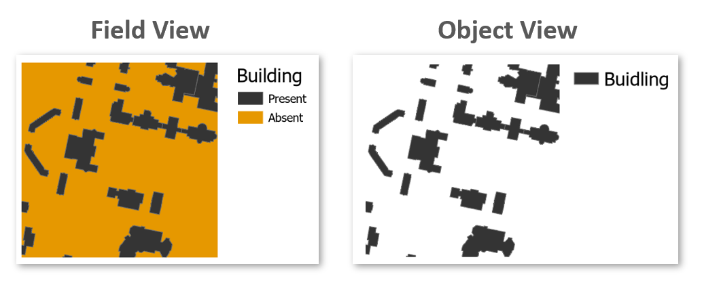

# (PART\*) PART 1: Working with spatial data {-}

# Feature Representation {#chp02_0}


## Introduction

Before we can analyze or visualize spatial data in a GIS, we must first decide how to represent real-world phenomena in a digital environment. This chapter introduces the foundational data models used in GIS--**vector** and **raster**--and explores how different types of geographic features are encoded using these models. Understanding how features are represented is essential for making informed decisions about data collection, storage, analysis, and visualization.

We’ll also examine conceptual frameworks such as the **object** vs. **field** view of the world, the role of scale in determining how features are modeled, and how attribute data are structured and classified. These concepts form the backbone of spatial data modeling and are critical for interpreting and working with spatial data effectively throughout the rest of the course.

## Vector vs. Raster

To work in a GIS environment, real world observations (objects or events that can be recorded in 2D or 3D space) need to be reduced to spatial entities. These spatial entities can be represented in a GIS as a **vector data model** or a **raster data model**. 

```{r vec-rast, echo=FALSE, fig.cap = "Vector and raster representations of a river feature.", fig.width=3, fig.align='center'}

knitr::include_graphics("img/vector_vs_raster.jpg")
```


### Vector

Vector features can be decomposed into three different geometric primitives: **points**, **polylines** and **polygons**.

Vector data models are used to represent discrete features like roads, buildings and boundaries. They also benefit from supporting rich attribute data and precise geometry.

Let’s explore how different types of features are represented using the vector model.

#### Point

```{r echo=FALSE, fig.cap = "Three point objects defined by their X and Y coordinate values.", fig.height=1.8, fig.width=1.8, fig.align='center'}
library(ggplot2)
OP <- par( mar=c(0,0,0,0))
 X <- c(1,3,2)
 Y <- c(2,1,3)
ggplot() + geom_point(aes(x=X, y=Y), size=2) +
      theme(title = NULL)  +        
      coord_cartesian(xlim = c(0,4), ylim = c(0,4))  +
     geom_text(aes(x=X, y=Y, label = paste("(",X,",",Y,")",sep="")), hjust = 1.2, size=3)
par(OP)
```

A point is composed of one coordinate pair representing a specific location in a coordinate system. Points are the most basic geometric primitives having no length or area. By definition a point can't be “seen” since it has no area; but this is not practical if such primitives are to be mapped. So points on a map are represented using *symbols* that have both area and shape (e.g. circle, square, plus signs).

We seem capable of interpreting such symbols as points, but there may be instances when such interpretation may be ambiguous (e.g. is a round symbol delineating the area of a round feature on the ground such as a large oil storage tank or is it representing the point location of that tank?).

#### Polyline

```{r echo=FALSE, fig.cap = "A simple polyline object defined by connected vertices.", fig.height=1.8, fig.width=1.8, fig.align='center'}

OP <- par( mar=c(0,0,0,0))
ggplot()  + geom_line(aes(x=X, y=Y), col="red", size=1) +
    theme(title = NULL)  +
    coord_cartesian(xlim = c(0,4), ylim = c(0,4)) +
   geom_point(aes(x=X, y=Y), size=2) +
   geom_text(aes(x=X, y=Y, label = paste("(",X,",",Y,")",sep="")),hjust = 1.2, size=3)
par(OP)

```


A polyline is composed of a sequence of two or more coordinate pairs called vertices. A vertex is defined by coordinate pairs, just like a point, but what differentiates a vertex from a point is its explicitly defined relationship with neighboring vertices. A vertex is connected to at least one other vertex.

Like a point, a true line can't be seen since it has no area. And like a point, a line is symbolized using shapes that have a color, width and style (e.g. solid, dashed, dotted, etc...). Roads and rivers are commonly stored as polylines in a GIS.

#### Polygon

```{r echo=FALSE, fig.cap = "A simple polygon object defined by an area enclosed by connected vertices.", fig.height=1.8, fig.width=1.8, fig.align='center'}
OP <- par( mar=c(0,0,0,0))
ggplot()  + 
   geom_polygon(aes(x=X, y=Y), col="red", fill="orange") +
   theme(title = NULL) +
   coord_cartesian(xlim = c(0,4), ylim = c(0,4)) +
  geom_point(aes(x=X, y=Y), size=2) +
  geom_text(aes(x=X, y=Y, label = paste("(",X,",",Y,")",sep="")), hjust = 1.2, size=3)
par(OP)
```

A polygon is composed of three or more line segments whose starting and ending coordinate pairs are the same. Sometimes you will see the words *lattice* or *area* used in lieu of 'polygon'. Polygons represent both length (i.e. the perimeter of the area) and area. They also embody the idea of an inside and an outside; in fact, the area that a polygon encloses is explicitly defined in a GIS environment. If it isn't, then you are working with a polyline feature. If this does not seem intuitive, think of three connected lines defining a triangle: they can represent three connected road segments (thus polyline features), or they can represent the grassy strip enclosed by the connected roads (in which case an 'inside' is implied thus defining a polygon).

### Raster

```{r echo=FALSE, fig.cap = "A simple raster object defined by a 10x10 array of cells or pixels.", fig.height=1.8, fig.width=1.8, fig.align='center'}

library(raster) 
r <- raster(nrows = 10, ncols=10, xmn=0, xmx=4, ymn=0, ymx=4) 
r[] <- runif(100)
OP <- par( mar=c(1,1,1,1))
 image(r, asp=1, axes=FALSE,xlab=NA, ylab=NA)
par(OP)

```

A raster data model uses an array of cells, or pixels, to represent real-world objects. Raster datasets are commonly used for representing and managing imagery, surface temperatures, digital elevation models, and any other continuous data. 

A raster can be thought of as a special case of an area object where the area is divided into a regular grid of cells. While rasters are often described as grids of cells, they can also be thought of as arrays of spatially referenced values, each tied to a specific location in space.

In a raster data model, each cell (or pixel) is explicitly associated with a value, representing a measurement or classification at that location. This contrasts with the vector model, where attribute values are linked to geometric features (points, lines, or polygons) and may not be defined for every location in space.

Raster datasets are organized as regular grids—typically square or rectangular in shape. If the spatial features of interest do not occupy the entire extent of the grid, the remaining cells are assigned special values such as `NULL` or `NoData` to indicate the absence of valid data.

## Object vs. Field

While the vector/raster distinction focuses on data structure, the **object** vs. **field** perspective focuses on how we **conceptualize** spatial phenomena. This distinction is especially useful when deciding how to model and analyze different types of spatial features. 

### Object View

The object view treats spatial features as discrete entities that exist independently and occupy specific locations. These features do not occur everywhere in space. Examples include point locations of cities, road networks, or polygonal representations of land parcels or urban areas. Objects are typically represented using the vector data model.

### Field View

The field view treats spatial phenomena as *continuous surfaces* or distributions that vary across space. A field is a property that can be measured at any location within a study area. Common examples include surface elevation, temperature, or precipitation. These are typically represented using the raster data model.

Some features can be represented as either *objects* or *fields*, depending on the analytical context. For instance, the presence or absence of buildings can be modeled as:

+ **Objects**, if we are interested in the location and shape of individual buildings.
+ **Fields**, if we are interested in identifying areas where buildings do or do not exist (e.g., using a binary raster where 1 = presence, 0 = absence).

```{r filed-object, echo=FALSE, fig.cap = "Field and Object representation of buildings.", fig.width=6, fig.align='center', dpi = 96}


```


Ultimately, the choice between object and field representations depends on the nature of the phenomenon and the goals of the analysis.

## Scale

In GIS, **scale** refers to the ratio between a distance on the map and the corresponding distance in the real world. For example, a scale of 1:10,000 means that one unit on the map represents 10,000 units on the ground.

It’s important to distinguish between two uses of the term:

+ **Cartographic scale** refers to the map’s level of detail.
+ **Analytical scale** refers to the spatial extent or resolution of a study.

In cartographic terms, a **large scale** map (e.g., 1:10,000) shows a small area in great detail, while a **small scale** map (e.g., 1:10,000,000) shows a large area with less detail. This is opposite to how *"large scale"* is often used in everyday language, where it implies a broad or extensive scope.

The following two maps of the Boston region illustrate this difference:

+  At a small scale (1:10,000,000), Boston and other cities may be represented as simple points.
+  At a large scale (1:34,000), Boston may be represented as a detailed polygon, and roads may appear as polygons rather than simple lines.

```{r echo=FALSE, fig.cap = "Map of the Boston area at a 1:10,000,000 scale. Note that in geography, this is considered small scale whereas in layperson terms, this extent is often referred to as a large scale (i.e. covering a large area).", fig.width=3.5, fig.align='center', dpi=60}

knitr::include_graphics("img/Boston_small_scale.jpg")
```


```{r echo=FALSE, fig.cap = "Map of the Boston area at a 1:34,000 scale. Note that in geography, this is considered large scale whereas in layperson terms, this extent is often referred to as a small scale (i.e. covering a small area).", fig.width=3.5, fig.align='center', dpi=60}

knitr::include_graphics("img/Boston_large_scale.jpg")
```

Understanding scale is essential for choosing appropriate data and representation methods in GIS analysis.

## Attribute Tables

In GIS, **attributes** are non-spatial data that describe the characteristics of spatial features--such as a city’s population, a road’s name, or a parcel’s land use type. A feature on a GIS map is linked to its record in the attribute table by a unique numerical identifier (ID). 

Each feature in a GIS layer is associated with one or more records in the attribute table, enabling a **one-to-one** or **many-to-one** relationship between geometry and descriptive data. Most GIS software allows users to click on a map feature and view its associated attributes directly.

Raster datasets can also store attribute information, but only when pixel values represent discrete categories (e.g., land cover classes). In such cases, each unique integer value may correspond to a class label or description. However, most raster datasets used in this course will represent continuous data and will not include attribute tables. 

### Measurement Levels

Attribute data can be broken down into four **measurement levels**:

 * **Nominal** data which have no implied order, size or quantitative information (e.g. paved and unpaved roads) 

 * **Ordinal** data have an implied order (e.g. ranked scores), however, we cannot quantify the difference since a linear scale is not implied.

 * **Interval** data are numeric and have a linear scale, however they do not have a true zero and can therefore not be used to measure *relative* magnitudes. For example, one cannot say that 60&deg;F is twice as warm as 30&deg;F since when presented in degrees &deg;C the temperature values are 15.5&deg;C and -1.1&deg;C respectively (and 15.5 is clearly not twice as big as -1.1). 

 * **Ratio** scale data are interval data with a true zero such as monetary value (e.g. $1, $20, $100).

### Data type

In GIS, choosing the correct **data type** for an attribute is essential for accurate data storage, efficient processing, and meaningful analysis. ArcGIS supports several common data types, including **integer**, **float**, **double**, and **text**. The choice of data type should align with the attribute’s measurement level and intended use.


The following table summarizes popular data types available in most GIS applications:


Type | Stored values                            | Note
-----|------------------------------------------|-----
Short integer | -32,768 to 32,767 | Whole numbers
Long integer | -2,147,483,648 to 2,147,483,647 | Whole numbers
Float | -3.4 * E-38 to 1.2 E38 | Real numbers
Double | -2.2 * E-308 to 1.8 * E308 | Real numbers
Text | Up to 64,000 characters | Letters and words


While whole numbers can be stored as floats or doubles (e.g., storing 2 as 2.0), doing so increases storage requirements. This may not be a concern for small datasets, but for large datasets with tens of thousands of records, it can impact file size and processing speed.

Conversely, storing decimal values as integers can lead to significant data loss. For example, values such as 0.2, 0.01, 0.34, 0.1, and 0.876 would all round to either 0 or 1, obscuring meaningful differences. This can distort map outputs, especially in choropleth visualizations, where subtle variations are important as shown in the following two figures.


```{r echo=FALSE, fig.cap = "Map of data represented as decimal (float) values.",  fig.height=3, message=FALSE, warning=FALSE, results='hide', fig.align='center'}

library(sf)
#library(spdep)
library(tmap)
library(RColorBrewer)
#fn     <- system.file("etc/shapes/eire.shp", package = "spdep")[1] 
#eire   <- st_read(fn) 
eire <- st_read(system.file("shapes/eire.gpkg", package="spData"))
st_crs(eire) <- st_crs("+proj=utm +zone=30 +units=km") 
eire$x <- round(log(eire$INCOME) / max(log(eire$INCOME)),2)
brks   <- seq(0.5,1.0, .1) 
brks[6] <- 1.00001 
clr     <- brewer.pal(5,"Greens")
coords <- st_coordinates(st_centroid(eire))
tm_shape(eire) + tm_polygons("x", style = "fixed", breaks = round(brks,1), 
                             pal = clr, title = "Original value") +
  tm_legend(outside = T) +
  tm_text(text = "x", size = 0.6)
```


```{r echo=FALSE, fig.cap = "Map of same data represented as integers instead of float.", fig.height=3, message=FALSE, warning=FALSE, fig.align='center'}
eire$x.int <- round(eire$x) 
tm_shape(eire) + tm_polygons("x.int", style = "fixed", breaks = round(brks,1), 
                             pal = clr, title = "Rounded value") +
  tm_legend(outside = T) +
  tm_text(text = "x.int", size = 0.6)

```

## Summary

This chapter introduces the foundational concepts of how geographic features are represented in a GIS environment. It begins by distinguishing between the two primary data models--*vector* and *raster*--and explains how real-world entities are encoded as points, lines, polygons, or grids of cells. 

The discussion then shifts to conceptual frameworks, including the object vs. field view of spatial phenomena, which helps clarify how the same feature can be represented differently depending on the analytical context. The importance of scale is also addressed, with a focus on how map detail and spatial extent influence representation choices.

Finally, the chapter explores attribute tables, which store non-spatial information linked to spatial features, and introduces key concepts such as measurement levels (nominal, ordinal, interval, ratio) and data types (integer, float, double, text). These distinctions are critical for ensuring accurate data storage, querying, and analysis in GIS workflows.
