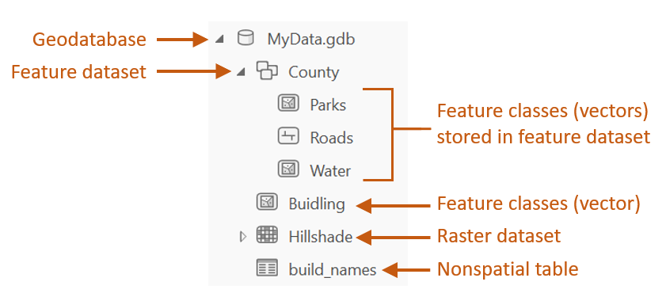
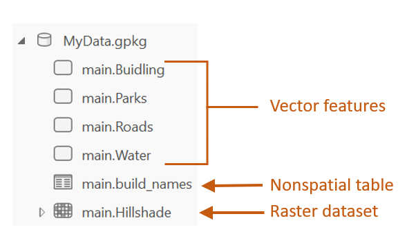
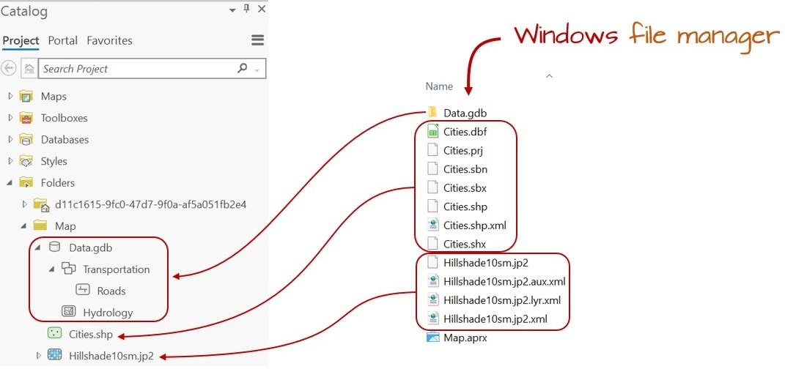
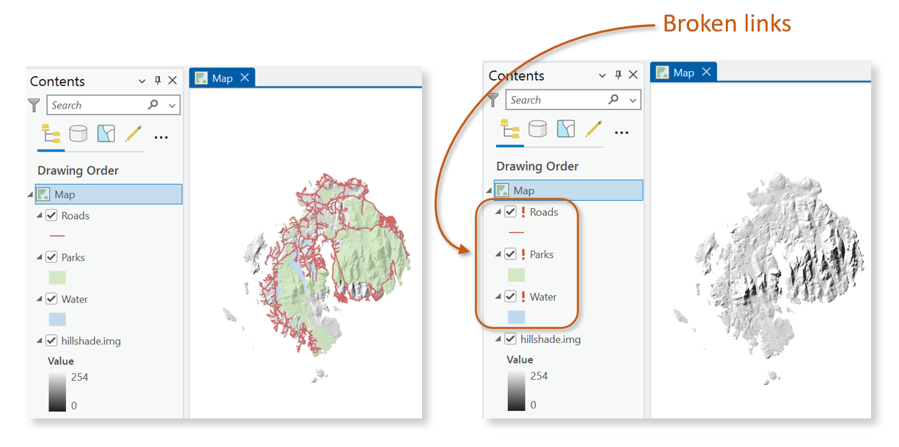

# GIS Data Management

## Introduction

Effective data management is essential to any GIS workflow. Whether working with spatial data for analysis, visualization, or sharing, understanding how GIS files are structured, stored, and organized ensures efficiency, and reproducibility. This chapter introduces the most common GIS file formats used for both vector and raster data, highlighting their strengths, limitations, and compatibility across platforms.

Beyond file formats, the chapter explores best practices for managing GIS projects within software environments like ArcGIS. Topics such project folder organization and file dependencies are covered to help avoid common pitfalls when working with complex spatial datasets. 

## GIS File Data Formats

In the GIS world, you will encounter many different GIS file formats. Some file formats are unique to specific GIS applications, others are universal. For this course, we will focus on a subset of spatial data file formats: **shapefiles** for vector data, **Imagine** and **GeoTiff** files for rasters and **file geodatabases** and **geopackages** for both vector and raster data.

### Vector Data File Formats

#### Shapefile

A **shapefile** is a file-based data format native to ArcView 3.x software (a much older version of ArcGIS Pro). Conceptually, a shapefile is a feature class--it stores a collection of features that have the same geometry type (point, line, or polygon), attributes, and spatial extent.

Despite its name, a shapefile is not a single file but a set of files that work together. At minimum, three files are required, but up to eight may be present. Each file shares the same base name but has a different extension, as shown below:

| File extension | Content                       |
|----------------|-------------------------------|
| .dbf           | Attribute information         |
| .shp           | Feature geometry              |
| .shx           | Feature geometry index        |
| .aih           | Attribute index               |
| .ain           | Attribute index               |
| .prj           | Coordinate system information |
| .sbn           | Spatial index file (optional)          |
| .sbx           | Spatial index file (optional)          |

While shapefiles are widely supported and simple to use, they have notable limitations, such as lack of support for topology, limited attribute field name lengths, and constraints on file size and data types.

#### File Geodatabase

A **file geodatabase** is a relational database storage format developed by Esri. It is a more complex and versatile structure than the shapefile, consisting of a **.gdb** folder that houses dozens of files. These files collectively store spatial features, attribute tables, indexes, metadata, and rules that define relationships between features.

One of the key advantages of a file geodatabase is its ability to store multiple feature classes (e.g. vector layers) and raster datasets within a single container. It also supports topological rules, which allow users to define spatial relationships between features—such as shared boundaries or connectivity between lines.

An example of a geodatabase's contents is shown in the following figure.

```{r f02-gdb, echo=FALSE, fig.cap = "Sample content of an ArcGIS file geodatabase.", out.width=444, fig.align='center'}


```

File geodatabases are efficient for managing large datasets and support advanced GIS operations. However, they are proprietary to ESRI and may have limited compatibility with non-ESRI software.

#### GeoPackage

A **GeoPackage** is a modern, open-standard data format built on top of SQLite--a lightweight, self-contained relational database. It is [non-proprietary](https://www.geopackage.org/) and designed for efficient storage and transfer of spatial data. One of its key advantages is compactness: coordinate values, metadata, attribute tables, projection information, and even multiple layers (vector and raster) can be stored in a single .gpkg file.

This structure makes GeoPackage highly portable and ideal for sharing complex GIS projects. Unlike shapefiles, which require multiple files, or file geodatabases, which are proprietary to Esri, GeoPackage offers a unified and open solution compatible with a wide range of applications including QGIS (2.12 and up), R, and ArcGIS Pro.

An example of a geopackage's contents is shown in the following figure.

```{r geopackage, echo=FALSE, fig.cap = "Sample content of a geopackage.", out.width=330, fig.align='center'}


```

While GeoPackage supports many advanced features, performance may vary depending on the software and dataset size. Some specialized capabilities, such as topology rules, may be more limited compared to Esri’s file geodatabase.

### Raster Data File Formats

Raster data represents spatial phenomena as a grid of cells (pixels), each storing a numeric value. These values can represent elevation, temperature, and land cover for example. Rasters are particularly well-suited for modeling continuous surfaces and are commonly used in remote sensing and environmental analysis.

One important characteristic of raster data is pixel depth, which defines the range of distinct values a raster can store. For example, a 1-bit raster can only store two values (0 and 1), while a 16-bit raster can store up to 65,536 distinct values. The following figure illustrates how pixel depth affects the range of values.

```{r pixeldepth, echo=FALSE, fig.cap = "Examples of different pixel depths.",  fig.height=3, fig.width=3, fig.align='center'}

## Function
pal <- function(col, border = "light gray", txt =TRUE,...)
{ n <- length(col)
  plot(0, 0, type="n", xlim = c(0, 1), ylim = c(0, 1),
       axes = FALSE, xlab = "", ylab = "", cex.main=1.5,...)
  rect(0:(n-1)/n, 0, 1:n/n, 1, col = col, border = border)
  if(txt == TRUE){
    text(0:(n-1)/n +(0.5/n), 0.4, as.character(seq(0,(n-1))),col=rev(h),cex=1)
  }

}

OP <- par(mfrow=c(5,1),mar=c(0,0,3,0))
# Binary
h <- grey(seq(0,1, length.out=2))
pal(h, main="1 bit (binary)")

# 2 bits
h <- grey(seq(0,1, length.out=4))
pal(h,main="2 bits")

# 4 bits
h <- grey(seq(0,1, length.out=16))
pal(h,main="4 bits")

# 8 bits
h <- grey(seq(0,1, length.out=256))
pal(h,main="8 bits",border="transparent",txt=FALSE)
text(c(0.05,0.95), 0.4, as.character(c(0,255)),col=c("white","black"),cex=1)

# 16 bits
h <- grey(seq(0,1, length.out=65536))
pal(h,main="16 bits",border="transparent",txt=FALSE)
text(c(0.05,0.95), 0.4, as.character(c(0,65535)),col=c("white","black"),cex=1)
par(OP)
```

Some of the most popular raster file formats are listed next

#### Imagine

The **Imagine** file format was originally created by an image processing software company called ERDAS. This file format consists of a single **.img** file. This is a simpler file format than the vector shapefile. It is sometimes accompanied by an .xml file which usually stores metadata information about the raster layer.

#### GeoTiff

A popular public domain raster data format is the **GeoTIFF** format. It extends the standard TIFF (Tagged Image File Format) by embedding georeferencing information directly within the file. This includes coordinate system, projection, datum, and spatial resolution, allowing the raster to be accurately placed in geographic space without the need for auxiliary files.

GeoTIFF is widely supported across GIS and remote sensing software, including QGIS, ArcGIS and R. Its portability, platform independence, and open specification make it a popular format for sharing raster data.

GeoTIFF also supports internal compression (e.g., LZW, DEFLATE, JPEG), which can reduce file size.

#### File Geodatabase

A raster file can also be stored in a file geodatabase alongside vector files. Geodatabases have the benefit of defining image mosaic structures thus allowing the user to create "stitched" images from multiple image files stored in the geodatabase. Also, processing very large raster files can be computationally more efficient when stored in a file geodatabase as opposed to an Imagine or GeoTiff file format.

#### GeoPackage

In addition to vector data, GeoPackage also supports raster data storage. Raster layers are stored in a tiled format within the same .gpkg file making it a compact and portable solution for mixed data types. GeoPackage is a good choice for sharing raster data across platforms due to its open standard and single-file structure.

### Comparison table

The following table summarizes key characteristics of the most commonly used GIS file formats discussed above. This comparison includes aspects such as data type, structure, portability, and support for topology and metadata.


```{css, echo=FALSE}
/* Your CSS rules for tables go here */
table {
  border-collapse: collapse; /* Removes spacing between cell borders */
  width: 100%; /* Optional: ensures table takes full available width */
}

th, td {
  padding: 1px 6px !important; /* Sets small padding (top/bottom: 4px, left/right: 8px) */
  text-align: left; /* Optional: aligns text to the left within cells */
  border: 1px solid #ddd !important; /* Optional: adds a light border to cells */
}

th {
  background-color: #f2f2f2 !important; /* Optional: adds a background to header cells */
}
}
```


| Format         | Type         | Structure       | Portability       | Topology Support | Metadata Support | Notes                                 |
|----------------|--------------|------------------|-------------------|------------------|------------------|----------------------------------------|
| Shapefile      | Vector        | Multi-file       | High              | No               | Limited          | Legacy format, widely supported        |
| File Geodatabase | Vector/Raster | Folder-based     | Low (ESRI only)   | Yes              | Strong           | Efficient for large datasets           |
| GeoPackage     | Vector/Raster | Single file       | High              | Partial          | Strong           | Open format, cross-platform            |
| Imagine (.img) | Raster        | Single file (+xml)| Medium            | N/A              | Moderate         | Common in remote sensing               |
| GeoTIFF        | Raster        | Single file       | High              | N/A              | Strong           | Public domain, widely supported        |


## Managing GIS Files in ArcGIS

Due to the complex and often multi-file structure of many GIS formats--such as shapefiles or file geodatabases--it is strongly recommended to manage GIS files (e.g., copy, move, delete, rename) from within the GIS software environment rather than through external tools like Windows File Explorer. GIS applications are designed to handle the internal dependencies and metadata links that exist between files.

Managing files outside of GIS software can lead to broken links, missing components, or corrupted datasets, especially when dealing with formats that span multiple files or folders. For example, a shapefile may appear as a single layer in ArcGIS but is actually composed of several interdependent files. Renaming or moving just one of these files manually can render the entire dataset unusable.

The figure below illustrates how ArcGIS Catalog simplifies file management by presenting complex datasets as unified entries, reducing the risk of accidental mismanagement.

```{r f02-catalog, echo=FALSE, fig.cap = "Windows File Explorer view vs. ArcGIS Catalog view. Note, for example, how the many files that make up the Cities shapefile (as viewed in a Windows file manager environment) appears as a single entry in the Catalog view. This makes it easier to rename the shapefile since it needs to be done only for a single entry in the GIS software (as opposed to renaming the Cities files seven times in the Windows file manager environment).", out.width=1071, fig.align='center'}


```

## Managing GIS Projects and File References

Unlike many other software environments--such as word processors or spreadsheets--a GIS project is not self-contained in a single file. Instead, it consists of a project file (e.g., `.aprx` in ArcGIS Pro or `.qgz` in QGIS) and a collection of external spatial data files (e.g., shapefiles, rasters, geodatabases, or geopackages). The project file stores information about how layers are symbolized and where the associated data files are located, but it does not embed the data itself.

Because of this structure, GIS software must be able to locate the external data files referenced in the project. If any of these files are renamed, moved, or deleted outside of the GIS environment (e.g., using *Windows' File Explorer*), the project file may no longer be able to find them. This results in **broken links**, which prevent the layers from loading properly.

In ArcGIS Pro, broken links are indicated by **exclamation marks** next to the affected layers in the *Contents* pane. This typically occurs when the file path stored in the project no longer matches the actual location of the data on disk.


```{r excla1, echo=FALSE, out.width=700, fig.align='center', fig.cap = "Figure shows an ArcGIS Pro project with properly referenced GIS layers (left) and the same project reopened after the associated data files were moved or deleted outside of ArcGIS (right). The broken links are indicated by exclamation marks next to the affected layers, signaling that the project can no longer locate the original data sources."}

```

To avoid these issues, it is best practice to:

+ Keep all project-related files in a single, well-organized folder.
+ Use **relative pathnames**, which store file locations relative to the project file’s location rather than as full absolute paths.
+ Avoid renaming, moving, or deleting GIS data files outside of the GIS software.

## Summary

This chapter introduced foundational concepts in GIS data management, emphasizing the importance of understanding file formats, project organization, and software-based file handling. It began by exploring common GIS file formats for both vector and raster data, including shapefiles, file geodatabases, GeoPackages, Imagine files, and GeoTIFFs. Each format was discussed in terms of structure, portability, metadata support, and compatibility across platforms.

The chapter then addressed best practices for managing GIS files within software environments like ArcGIS Pro and QGIS. It highlighted the risks of manipulating GIS files outside of these environments.


