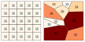
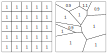
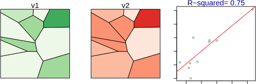

```{r include=FALSE, cache=FALSE}
knitr::opts_chunk$set(
  comment = "",
  message = FALSE,
  tidy = FALSE,
  cache = TRUE,
  warning = FALSE,
  encoding = "UTF-8",
  fig.show='hold')

knitr::opts_knit$set(list(width = 80))

# Set margins
knitr::knit_hooks$set(small.mar = function(before, options, envir) {
  if (before) par(mar = c(4, 4, 1, 1))  # smaller margin on top and right
})

knitr::knit_hooks$set(no.mar = function(before, options, envir) {
  if (before) par(mar = c(0, 0, 0, 0))  # no margins
})


```
# Pitfalls to avoid

## Introduction

Spatial data analysis offers powerful tools for uncovering patterns, relationships, and insights across geographic space. However, with this power comes a set of challenges that can easily mislead if not properly understood and addressed. This chapter explores several common pitfalls in spatial analysis, focusing on how data representation, aggregation, and interpretation can distort our understanding of spatial phenomena.

We begin by examining how the choice of spatial units and aggregation schemes can dramatically alter the appearance of spatial patterns, a problem known as the Modifiable Areal Unit Problem (MAUP). We then explore the ecological fallacy, where inferences about individuals are mistakenly drawn from aggregate-level data. These issues are compounded when mapping raw counts without accounting for differences in area or population, leading to misleading choropleth maps and unstable rate estimates.

To address these challenges, we introduce techniques for normalizing data, smoothing unstable rates, and framing interpretations appropriately. 


## Representing Count

Consider a 5km × 5km study area populated by individuals arranged in a perfect grid. If we overlay two different zoning schemes—one using a uniform grid and another using irregular polygons—and count the number of individuals within each zone, we produce two choropleth maps that suggest very different spatial distributions. Yet, the underlying point pattern is identical.

```{r grid-vs-tess-layout, echo=FALSE, fig.cap = "Layout of individual units with two different zonal unit overlays.", fig.align='center'}

knitr::include_graphics("img/grid_vs_tess_layout.svg")
```

 
```{r grid-vs-tess-count, echo=FALSE, fig.cap = "Count of individuals in each zonal unit. Note how an underlying point distribution can generate vastly different looking choropleth maps given different aggregation schemes.", fig.align='center'}


```

This discrepancy illustrates a fundamental pitfall in spatial analysis: the appearance of spatial patterns can be heavily influenced by the choice of aggregation units [@Unwin1]. Non-uniform aerial units can create misleading impressions of clustering or dispersion, even when none exists. This phenomenon is closely related to the Modifiable Areal Unit Problem (MAUP), which is discussed in the next section.

To mitigate this issue, it is often better to represent counts as ratios—for example, population per square kilometer or deaths per capita. These normalized measures reduce the influence of arbitrary zone shapes and sizes, offering a more reliable representation of spatial intensity. In Figure \@ref(fig:grid-vs-tess-density), switching from raw counts to density maps reveals a more consistent and interpretable spatial pattern.


```{r grid-vs-tess-density, echo=FALSE, fig.cap = "Point density choropleth maps. The sample study extent is 20x20 units which generates a uniform point density of 1. The slight discrepancy in values for the map on the right is to be expected given that the zonal boundaries do not split the distance between points exactly.", fig.align='center'}


```

## MAUP

The **Modifiable Areal Unit Problem (MAUP)** [@openshaw1983maup] is a well-documented issue in spatial analysis that arises when data are aggregated into spatial units such as census tracts, counties, or states. These units are often arbitrary with respect to the phenomena being studied. O'Sullivan and Unwin [@Unwin1] further emphasize that MAUP is not just a technical nuisance--it challenges the validity of spatial inference when based on aggregated data.

Consider a uniform distribution of individuals across a study area, each with two recorded variables: v1 and v2. The variables are symbolized as varying shades of green and reds in the two left-hand maps of Figure  \@ref(fig:v1-and-v2-raw)). 

```{r v1-and-v2-raw, echo=FALSE, fig.cap = "Plots of variables v1 and v2 for each individual in the survey. The color scheme is sequential with darker colors depicting higher values and lighter colors depicting lower values.", out.width=550, fig.align='center'}

knitr::include_graphics("img/v1_and_v2_raw.png")
```

At the individual level, a scatterplot reveals no meaningful correlation between these variables--both the slope and the coefficient of determination ($R^2$) are close to zero.

However, when the same data are aggregated using a uniform zoning scheme, a weak correlation emerges. 

```{r v1-and-v2-unif, echo=FALSE, fig.cap = "Data summarized using a uniform aggregation scheme. The resulting regression analysis is shown in the right-hand plot. Note the slight increase in slope and $R^2$ values.", out.width=550, fig.align='center'}

knitr::include_graphics("img/unif_aggr.svg")
```

If we then apply a non-uniform aggregation scheme, the correlation appears even stronger, with a much higher $R^2$ value.

```{r v1-and-v2-nonunif, echo=FALSE, fig.cap = "Data summarized using a non-uniform aggregation scheme.The resulting regression analysis is shown in the right-hand plot.", out.width=550, fig.align='center'}


```

This discrepancy is not due to any real relationship between v1 and v2, but rather to the aggregation scheme itself. In fact, it is possible to design an aggregation scheme that produces a near-perfect correlation between two variables that are entirely uncorrelated at the individual level. This is the nature of MAUP: different aggregation schemes can yield dramatically different analytical outcomes! 


## Ecological Fallacy

As is often the case, analyses can be constrained by the data at hand. It’s important to recognize the limits of what such data can tell us. A common mistake is to assume that relationships observed at the group level also apply to individuals within those groups. This misstep is known as the **ecological fallacy** [@freedman1999ecological].

For example, if the analysis was conducted with the data summarized using the non-uniform aggregation scheme shown in Figure  \@ref(fig:v1-and-v2-nonunif),  it might be tempting to conclude that individuals with high values of v1 also tend to have high values of v2. However, this inference is not supported by the data. The observed correlation exists *only* at the level of the aggregated units--it may not hold, and often does not hold, at the individual level.  

To avoid the ecological fallacy, analysts must be cautious in how they interpret and report results from aggregated data. It is appropriate to say, *“At this level of aggregation, we observe a strong relationship between v1 and v2,”* but it is incorrect to claim that this relationship necessarily exists at finer scales. 

## Mapping rates

You learned earlier in this chapter of the pitfalls in mapping raw counts without accounting for differences in the size or shape of the spatial units. To address this, counts should be normalized—either by area (e.g., people per square kilometer) or by population (e.g., deaths per 100,000 people). This transforms raw counts into rates, which are more meaningful for comparison across regions. 

To illustrate this, let’s examine a series of maps showing kidney cancer death rates by county for the period 1980-1984.


```{r f05-kidney0, echo=FALSE, fig.cap = "Kidney cancer death rates for the period spanning 1980-1984.", out.width=504, fig.align='center'}

knitr::include_graphics("img/raw_rates.png")
```

We begin by looking at the counties with the highest death rates:

```{r f05-kidney1, echo=FALSE, fig.cap = "Top 10% of counties with the highest kidney cancer death rates.", out.width=466, fig.align='center'}

knitr::include_graphics("img/top10.png")
```

Now compare this to the counties with the lowest death rates:

```{r f05-kidney2, echo=FALSE, fig.cap = "Bottom 10% of counties with the lowest kidney cancer death rates.", out.width=451, fig.align='center'}

knitr::include_graphics("img/bottom10.png")
```

At first glance, these maps suggest that both high and low rates are clustered in similar regions. In fact, many of the counties with the lowest rates are adjacent to those with the highest rates. This raises questions: If environmental factors are driving kidney cancer mortality, why would they affect one county but not its neighbor? Could differences in local regulations or healthcare access explain the pattern?

Before jumping to conclusions, we need to examine the population counts behind these rates:

```{r f05-kidney3, echo=FALSE, fig.cap = "Population count for each county. Note that a quantile classification scheme is adopted forcing a large range of values to be assigned a single color swatch.", out.width=504, fig.align='center'}

knitr::include_graphics("img/Population.png")
```

The central part of the states where we are observing both very high and very low cancer death rates have low population counts. Could population count have something to do with this odd congruence of high and low cancer rates? 

To explore this further, let’s examine the relationship between death rates and population counts:

```{r f05-kidney-plot, echo=FALSE, fig.cap = "Plot of rates vs population counts. Note the skewed nature of both data batches.", out.width=300, fig.align='center'}

knitr::include_graphics("img/Rate_vs_pop.png")
```

The scatterplot reveals a wide spread of rates among counties with small populations. When we transform both axes to a logarithmic scale, the pattern becomes clearer:

```{r f05-kidney-plot-trans, echo=FALSE, fig.cap = "Plot of rates vs population counts on log scales.", out.width=300, fig.align='center'}
knitr::include_graphics("img/Rate_vs_pop_log.png")
```

Here, we see that as population increases, the variability in death rates decreases. This is expected: larger populations provide more stable estimates of underlying rates. In contrast, small populations produce unstable rates that can distort spatial patterns.

This issue is well-documented in spatial analysis literature. O'Sullivan and Unwin [@Unwin1] emphasize that mapping raw rates without considering population size can lead to misleading interpretations, especially in public health contexts.

To illustrate the problem, consider a county with a population of 1,000. If the true death rate is 5 per 100,000, we would expect 0.05 deaths--that's less than one person. But if one person dies, the observed rate in that county becomes 1 per 1,000, or 100 per 100,000--twenty times higher than the expected rate! This demonstrates how **small denominators can inflate rates** and create artificial hotspots and coldspots.

Rates that are computed using relatively small "at risk” population counts are deemed **unstable**. The next section explores one technique--Empirical Bayes smoothing--which can help reduce the influence of unstable rates and reveals more reliable spatial patterns.

## Empirical Bayes Smoothing

When mapping disease rates, especially for rare conditions, small population counts can lead to unstable rate estimates. These unstable rates often manifest as extreme values—either very high or very low—in sparsely populated counties. To address this, we turn to a statistical technique known as **Empirical Bayes (EB) smoothing**.

Let’s begin by revisiting the kidney cancer example where we observed that counties with small populations tend to produce highly variable death rates. This variability is not necessarily indicative of true differences in cancer risk--it’s often a mathematical artifact. To mitigate this, EB smoothing adjusts each county’s rate toward the overall mean, with the degree of adjustment depending on the population size.

An EB smoothed representation of kidney cancer deaths gives us the following rate vs population plot:

```{r EBRate-vs-pop-log, echo=FALSE, fig.cap = "Plot of EB smoothed rates vs population counts on log scales.", out.width=300, fig.align='center'}
knitr::include_graphics("img/EBRate_vs_pop_log.png")
```

The variability in rates for smaller counties has decreased. The range of rate values has dropped from 0.00045 to 0.00023. Variability is still greater for smaller counties than larger ones, but not as pronounced as it was with the raw rates 

Let’s now examine how EB smoothing affects the spatial distribution of extreme rates. First, we look at the top 10% of counties with the highest EB-smoothed death rates:

```{r f05-top10-EB, echo=FALSE, fig.cap = "Top 10% of counties with the highest kidney cancer death rates using EB smoothing techniques.", out.width=466, fig.align='center'}
knitr::include_graphics("img/top10EB.png")
```

Next, we examine the bottom 10%:

```{r f05-bottom10-EB, echo=FALSE, fig.cap = "Bottom 10% of counties with the lowest kidney cancer death rates using EB smoothing technique.", out.width=451, fig.align='center'}
knitr::include_graphics("img/bottom10EB.png")
```

Notice how the spatial pattern has changed. High-rate counties now appear in Florida, which aligns with expectations given the region’s older population. However, it’s important to remember that EB smoothing does not uncover the *true* underlying rates--it simply reduces the influence of unreliable estimates. 

Beyond EB smoothing, other strategies for dealing with unstable rates include:

 * Grouping small counties into larger ones--thus increasing population sample size.

 * Increasing the study's time interval. In this working example, data were aggregated over a five year period (1980-1984) but they could be increased by adding five more years worth of data.

 * Grouping small counties and increasing the study's time interval.

These solutions do have their downside in that they decrease the spatial and/or temporal resolutions. A thoughtful analysis will weigh these options based on the goals of the study and the nature of the data. 

## Summary

This chapter has explored several key pitfalls in spatial data analysis, emphasizing how choices in data representation, aggregation, and interpretation can distort our understanding of geographic patterns. We examined how raw counts can mislead when mapped without normalization, and how aggregation schemes can artificially inflate correlations--a phenomenon known as the Modifiable Areal Unit Problem (MAUP). We also discussed the ecological fallacy, where group-level patterns are incorrectly assumed to apply to individuals.

Through the example of kidney cancer mortality rates, we saw how small population counts can produce unstable rates that exaggerate spatial variation. To address this, we introduced Empirical Bayes smoothing, a technique that stabilizes rate estimates by borrowing strength from the overall distribution. While EB smoothing improves interpretability, it does not reveal true underlying rates and must be used with care.

