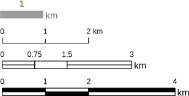
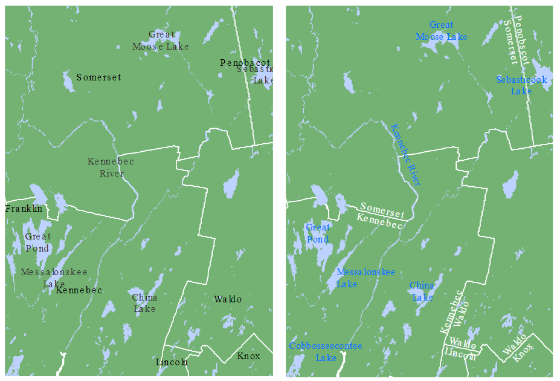

# Good Map Making Tips

## Introduction

While this course does not focus on cartography, it’s important to recognize that how we present spatial data can significantly influence how it’s interpreted. Even the most rigorous analysis can be undermined by poor map design. This chapter offers a brief overview of practical map-making principles--not as a deep dive into cartographic theory, but as a guide to help you avoid common pitfalls and make thoughtful design choices.

We’ll walk through examples of both ineffective and improved maps, highlighting how layout, color, typography, and supporting elements like legends and scale bars contribute to a map’s clarity and impact. The goal here isn’t to master cartographic technique, but to develop an eye for what makes a map readable, purposeful, and appropriate for its audience.

## Elements of a Map

Maps often include a variety of elements: the main map body, legend, title, scale bar, orientation indicator (e.g., north arrow), inset map, and source or ancillary information.

Not all elements are necessary in every map. In fact, some may be inappropriate depending on the context. For example, a scale bar may be misleading if the coordinate system used does not preserve distance uniformly across the map’s extent.

The purpose and audience of the map should guide its layout. If the map is intended for inclusion in a paper or report, simplicity and clarity should take precedence. If it’s a standalone map, additional elements may be warranted. Similarly, a general audience may benefit from a cleaner, less technical presentation, while a more specialized audience might appreciate added detail.

```{r f06-map, echo=FALSE, fig.cap = "Map elements. Note that not all elements are needed, nor are they appropriate in some cases. Can you identify at least one element that does not belong in the map (hint, note the orientation of the longitudinal lines; are they parallel to one another? What implication does this have on the North direction and the placement of the North arrow? src. Esri)", fig.height=4, fig.align='center'}

knitr::include_graphics("img/Map_elements.png", dpi = NA)
```


## How to Create a *Good* Map

Let’s begin with a cautionary example—a map layout that demonstrates several poor design choices.

```{r Bad-map, echo=FALSE, fig.cap = "Example of a *bad* map. Can you identify the problematic elements in this map? ", fig.align='center'}

knitr::include_graphics("img/Bad_map.jpg")
```

+ A good map establishes a clear **visual hierarchy**, ensuring that the most important elements—typically the main map body, title (if standalone), and legend—are visually dominant. Supporting elements like scale bars and north arrows should be placed lower in the hierarchy unless they serve a critical navigational purpose.

+ When designing choropleth maps, limit the number of **color swatches** to fewer than twelve. Too many colors can overwhelm the viewer and make it difficult to match map regions to legend categories. Classification breaks should be chosen deliberately—quantile schemes can help distribute colors evenly across the map, while theory-driven breaks may better reflect meaningful thresholds.

+ **Scale bars** and **north arrows** should be used judiciously. They are essential in reference maps (e.g., USGS topographic maps) but often unnecessary in thematic maps, where the focus is on comparing values across regions rather than measuring distances. If included, these elements should be visually subtle.


```{r ScaleBar, echo=FALSE, fig.cap = "Scale bar designs from simplest (top) to more complex (bottom). Use the simpler design if it's to be placed low in the visual hierarchy.", fig.align='center'}


```

+ **Title** and other **text elements** should be concise. If the map is embedded in a report or article, these elements can be omitted in favor of figure captions and accompanying text.

Let’s now look at an improved map layout that applies these principles. A divergent color scheme is used to highlight variation around a median income value. The coordinate system preserves distance and orientation, justifying the inclusion of a scale bar and north arrow. The inset map is placed low in the hierarchy and could be omitted for audiences familiar with the region. The legend is ordered to reflect the spatial gradient in the data.

```{r Good-map, echo=FALSE, fig.cap = "Example of an *improved* map.", fig.align='center'}
knitr::include_graphics("img/Good_map.jpg")
```

## Typefaces and Fonts

Typography plays a subtle but important role in map design. A general rule is to limit the number of fonts to two: a **serif** and a **sans serif** font.

```{r f06-serif, echo=FALSE, fig.cap = "Serif fonts are characterized by brush strokes at the letter tips (circled in red in the figure). Sans Serif fonts are devoid of brush strokes.", fig.align='center'}

```

Serif fonts are typically used for natural features such as rivers, lakes, and mountain ranges. Sans serif fonts are better suited for human-made features like roads, cities, and administrative boundaries.

Avoid excessive variation in font size unless you are intentionally creating a hierarchy of labels. Likewise, stick to a single font color unless you need to distinguish between categories. The following example shows how thoughtful use of font style and color can improve legibility and feature separation.

```{r f06-typeset, echo=FALSE, fig.cap = "The lack of typeset differences makes the map on the left difficult to differentiate county names from lake/river names. The judicious use of font colors and style on the right facilitate the separation of features.", out.width=600, fig.align='center'}

```

## Summary

In this chapter, we explored the essential principles of effective map design, emphasizing clarity, purpose, and audience awareness. A good map is not just visually appealing--it communicates spatial information with precision and intent. By establishing a clear visual hierarchy, limiting unnecessary elements, and choosing appropriate color schemes and fonts, a map can guide viewers toward meaningful interpretation. 

We also examined how scale bars, north arrows, and text elements should be used thoughtfully, and how typographic choices can enhance legibility. Through examples of poor and improved map layouts, we highlighted the importance of deliberate design decisions. Ultimately, good map making is about balancing aesthetics with function, ensuring that every element serves the story the map is meant to tell.