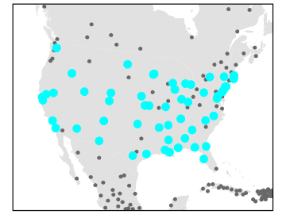
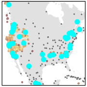
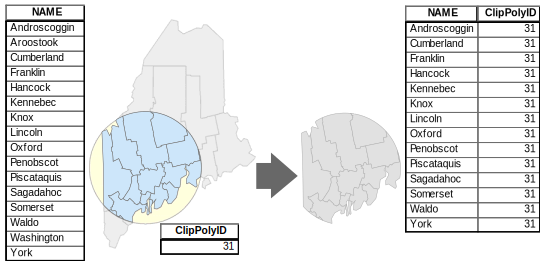

# Spatial Operations and Vector Overlays

```{r include=FALSE, cache=FALSE}
knitr::opts_chunk$set(
  comment = "",
  message = FALSE,
  tidy = FALSE,
  cache = TRUE,
  warning = FALSE,
  encoding = "UTF-8",
  fig.show='hold')

knitr::opts_knit$set(list(width = 80))

# Set margins
knitr::knit_hooks$set(small.mar = function(before, options, envir) {
  if (before) par(mar = c(4, 4, 1, 1))  # smaller margin on top and right
})

knitr::knit_hooks$set(no.mar = function(before, options, envir) {
  if (before) par(mar = c(0, 0, 0, 0))  # no margins
})

```


## Introduction

Spatial operations are at the heart of GIS analysis. Whether you're querying features based on their attributes or analyzing how layers interact spatially, these tools allow us to extract meaningful insights from geographic data. This chapter introduces three core operations: selection by attribute, selection by location, and vector overlay. Each is illustrated with examples and figures to help clarify how they work in practice.

## Selection by Attribute

GIS layers often contain rich attribute data that can be queried to isolate features of interest. For example, if a layer represents land parcels, we might want to select all parcels with an area greater than 2.0 acres. This is where **set algebra** and **Boolean** logic come into play.

### Set Algebra

Set algebra includes basic comparison operators:

 * less than (`<`), 
 * greater than (`>`), 
 * equal to (`=`)
 * not equal to (`<>`).

> In some programming environments (such as R and Python), the equality condition is expressed using **two** equal signs, `==`, and not one. In such an environment `x = 3` is interpreted as "*pass the value 3 to x*" and `x == 3` is interpreted as "*is x equal to 3?*.


Suppose we want to select all cities with a population greater than 50,000. Assuming the population field is named `POP`, the expression would be:

```
"POP" > 50000
```
In ArcGIS, one would use the `Select Layer by Attributes` tool.

```{r f08-sel1, echo=FALSE, fig.cap = "An example of the *Select Layer by Attributes* tool in ArcGIS Pro  where the pull-down menu is used to define the selection.", out.width=358}

knitr::include_graphics("img/Select_attribute_1.jpg")
```

```{r f08-sel2, echo=FALSE, fig.cap = "An example of the *Select Layer by Attributes* tool in ArcGIS Pro  where the SQL syntax is used to define the selection.", out.width=358}

knitr::include_graphics("img/Select_attribute_2.jpg")
```


```{r f08-sel1-result, echo=FALSE, fig.cap = "Selected cities meeting the criterion are shown in cyan color in ArcGIS Pro."}
knitr::include_graphics("img/Select_cities.svg")
```

Note that most GIS platforms do not create a new layer when performing selections—they simply highlight the matching features.

### Boolean Algebra

Boolean logic allows us to combine multiple conditions:

 * `or` (either conditions *can* be met), 
 * `and` (both conditions *must* be met), 
 * `not` (condition *must not* be met).

Let’s refine our previous example. Suppose we want to select cities with a population over 50,000 that are located in the United States. If the country field is labeled `FIPS_CNTRY`, the expression would be:

``` 
`"POP" > 50000 AND "FIPS_CNTRY" = US`
```

Once the query is executed, the selected cities are highlighted in cyan:


```{r sel3, echo=FALSE, fig.cap = "Selected cities meeting  where POP &gt; 50000  AND  FIPS_CNTRY == US criteria are shown in cyan color."}



```


## Selection by location

In addition to attribute queries, GIS allows us to select features based on their spatial relationship to other layers. These relationships include:

+ **Adjacency** features that share a boundary
+ **Containment** features that are entirely within another
+ **Intersection**  features that overlap
+ **Distance** features within a specified proximity

For example, we might want to select cities that are within `100 miles` of recorded earthquake events. The earthquake data comes from a separate layer named `Earthquakes.` 

```{r f08-loc1, echo=FALSE, fig.cap = "An example of a *Select Layer by Location* tool in ArcGIS Pro. The spatial association chosen is distance.", out.width=300}

knitr::include_graphics("img/Select_location_1.jpg")
```

This generates the following selection:

```{r f08-loc1-map, echo=FALSE, fig.cap = "Selected cities meeting the criterion are shown in cyan color.", out.width=300}

```


## Vector Overlay


Vector overlay is a foundational concept in GIS, dating back to pre-digital methods like sieve mapping, where planners used transparent layers to identify suitable areas for development. Today, vector overlay involves combining two or more layers to produce a new output layer. The three most common overlay operations are: **clipping**, **intersecting** and **unioning**.

### Clipping

**Clipping**  uses one layer (the clip feature) to trim another layer (the input feature). The result is a subset of the input layer, restricted to the area defined by the clip feature. Only the attributes of the input layer are retained.

```{r f08-clip, fig.cap = "The Maine counties polygon layer is clipped to the circle polygon. Note that the ouput layer is limited to the county polygon geometry and its attributes (and does not include the clipping circle polygon).", echo=FALSE}
knitr::include_graphics("img/Clip.svg")
``` 

### Intersecting

**Intersecting** combines two layers and outputs only the features that share spatial overlap. The resulting layer inherits attributes from both input layers.

```{r f08-intersect, fig.cap = "The Maine counties polygon layer is intersected with the circle polygon. The ouput layer combines both intersecting geometries and attributes.", echo=FALSE}

``` 

### Unioning

**Unioning** overlays both input layers and retains all features from both. Where features overlap, new polygons are created. The output layer typically contains more polygons than either input layer alone, and includes attributes from both sources. Areas without overlap may be assigned `NULL` or zero values.

```{r f08-union, fig.cap = "The Maine counties polygon layer is unioned with the circle polygon. The ouput layer combines both (complete) geometries and attributes. Where spatial overlaps do not occur, most software will either assign a NULL value or a 0.", echo=FALSE}
knitr::include_graphics("img/Union.svg")
``` 

## Summary

This chapter introduced key spatial operations used in GIS, focusing on how we select and manipulate geographic features based on their attributes and spatial relationships. We explored selection by attribute using set and Boolean algebra, and demonstrated how spatial selection can be based on proximity, containment, or intersection with other layers. We then examined vector overlay techniques--clip, intersect, and union--which allow us to combine multiple layers and extract meaningful spatial intersections. 
