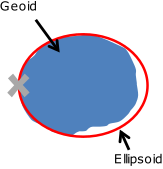
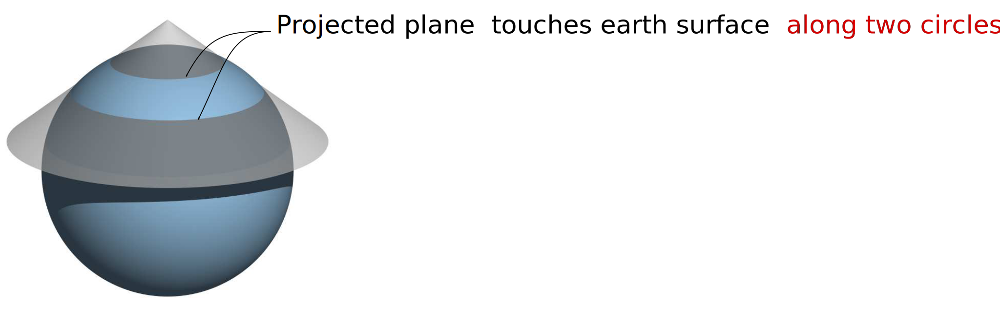

# Coordinate Systems {#chp09_0}

## Introduction

Every GIS dataset is tied to a spatial reference system, which defines how locations are represented and interpreted. This system may be arbitrary—such as a 10 m × 10 m sampling grid in a forest plot or the layout of a soccer field—or it may be geographic, linking spatial features to positions on the Earth’s surface. This chapter focuses on Earth-based reference systems, which fall into two main categories: **Geographic Coordinate Systems (GCS)** and **Projected Coordinate Systems (PCS)**. 

## Geographic Coordinate Systems

A geographic coordinate system (GCS) is a reference framework used to identify locations on the curved surface of the Earth. Locations are measured in angular units from the Earth's center, relative to two intersecting planes: the equatorial plane and the prime meridian plane (which passes through Greenwich, England). A location is therefore defined by two values: a **latitude** and a **longitude**.

```{r f09-latlong, echo=FALSE, fig.cap = "Examples of latitudinal lines are shown on the left and examples of longitudinal lines are shown on the right. The 0&deg; degree reference lines for each are shown in red (equator for latitudinal measurements and prime meridian for longitudinal measurements)."}

knitr::include_graphics("img/lat_vs_lon.png")
```

Latitude measures the angle between the equatorial plane and a location on the Earth's surface. Longitude measures the angle between the prime meridian plane and the north-south plane that intersects the location of interest. For example, Colby College is located at approximately 45.56&deg; North and 69.66&deg; West. In a GIS environment, directions are encoded using signs: North and East are assigned a positive (+) sign, while South and West are assigned a negative (-) sign. Colby College’s location is therefore encoded as +45.56&deg; and -69.66&deg;.

```{r f09-sphere-slice, echo=FALSE, fig.cap="A slice of Earth showing the latitude and longitude measurements."}
knitr::include_graphics("img/Colby_location_sphere.jpg", dpi=NA)
```

A GCS is defined by  three components: **ellipsoid**, **geoid** and **datum**. These are introduced next.

### Sphere and Ellipsoid

Assuming the Earth is a perfect sphere simplifies mathematical calculations and is often sufficient for small-scale maps (i.e., maps that cover large areas). However, for large-scale maps where accuracy is critical, an ellipsoidal model is preferred. An ellipsoid is defined by two radii: the **semi-major axis** (equatorial radius) and the **semi-minor axis** (polar radius). 

```{r f09-ellipse-axes0, echo=FALSE, fig.cap = "Ellipsoid axes."}

```

The Earth’s slightly ellipsoidal shape results from its rotation, which induces a centripetal force along the equator. This causes the equatorial radius to be approximately 21 km longer than the polar radius.

```{r f09-sphere-ellipse, echo=FALSE, fig.cap = "The Earth can be mathematically modeled as a simple sphere (left) or an ellipsoid (right)."}
knitr::include_graphics(c("img/globe_0_0_center.png","img/globe_0_0_center_wide.png" ))
```

Thanks to satellite and computational technologies, we now have precise estimates of these radii: the semi-major axis is 6,378,137 meters, and the semi-minor axis is 6,356,752 meters.

Although the differences between distances measured on a sphere versus an ellipsoid are small, they are measurable--up to 20 km in some cases--as illustrated in the following lattice plots.

```{r f09-dist-diff, echo=FALSE, fig.cap = "Differences in distance measurements between the surface of a sphere and an ellipsoid. Each graphic plots the differences in distance measurements made from a single point location along the 0&deg; meridian identified by the green colored box (latitude value) to various latitudinal locations along a longitude (whose value is listed in the bisque colored box). For example, the second plot from the top-left corner plot shows the differences in distance measurements made from a location at 90&deg; north (along the prime meridian) to a range of latitudinal locations along the 45&deg; meridian."}
knitr::include_graphics(c("img/Ellipsoid_vs_sphere_distances.svg"))
```

### Geoid

The **geoid** represents the Earth’s true shape as defined by its gravitational potential. Unlike the smooth surface of an ellipsoid, the geoid has subtle undulations caused by variations in gravitational pull across the planet. These undulations are not visible to the naked eye but are measurable and can influence positional accuracy.

In this context, we are not concerned with topographic features like mountains or ocean trenches. Instead, we focus on the gravitational surface—imagine the Earth completely submerged in water and measure the distance from the center of the Earth to the water surface at every location.

```{r f09-geoid, echo=FALSE, fig.cap = "Earth's EGM 2008 geoid. The ondulations depicted in the graphics are exaggerated x4000.", out.width=250}

```

The Earth’s gravitational field is dynamic, influenced by the movement of its molten core. As a result, the geoid is constantly changing, albeit over long time scales. The science of measuring and modeling the Earth’s shape is known as **geodesy**, a branch of applied mathematics.

### Datum

To reconcile the simplicity of an ellipsoidal model with the complexity of the geoid, we align the two. This alignment defines a datum. A datum allows us to map the Earth’s surface features onto an ellipsoid (or sphere) in a way that approximates the geoid. 

The alignment can be:

+  **Local**, where the ellipsoid is closely fitted to the geoid at a specific location (e.g., Kansas), or
+  **Geocentric**, where the ellipsoid is aligned with the Earth’s center of mass.

```{r f09-datum, echo=FALSE, out.width=750, fig.cap="Alignment of a geoid with a spheroid or ellipsoid help define a datum."}
knitr::include_graphics("img/datum.png" )
```

#### Local Datum

```{r f09-datum-local, echo=FALSE, out.width=250, fig.cap="A local datum couples a geoid with the ellipsoid at a location on each element's surface."}

```

There are many local datums, both historical and modern. The choice of datum is typically driven by geographic context. For example:

+  **NAD27** (North American Datum of 1927) is widely used in the U.S., especially in older maps.
+  **ED50** (European Datum of 1950) is common in Western Europe.
+  **WGS72** (World Geodetic System 1972) was developed for global use by the U.S. Department of Defense.

#### Geocentric Datum

```{r f09-datum-geocentric, echo=FALSE, out.width=250, fig.cap="A geocentric  datum couples a geoid with the ellipsoid at each element's center of mass."}
knitr::include_graphics("img/Datum_geocentric.svg" )
```

Modern datums typically use a geocentric alignment. Examples include:

+ **NAD83** (North American Datum of 1983)
+ **ETRS89** (European Terrestrial Reference System 1989)
+ **WGS84** (World Geodetic System 1984)

Most modern datums use either the WGS84 or GRS80 ellipsoid, which have nearly identical dimensions: a semi-major axis of 6,378,137 meters and a semi-minor axis of 6,356,752 meters.

### Building the Geographic Coordinate System

A Geographic Coordinate System is largely defined by two components:

1. The ellipsoid model, and
2. The way this ellipsoid is aligned with the geoid (i.e., the datum).

It is important to know which GCS is associated with a GIS dataset or map document. This is especially critical when combining layers that use different datums. A single location on Earth can have different coordinate values depending on the GCS used.

For example, a point recorded as 44.56698° N, 69.65939° W in NAD27 may appear as 44.56704&deg; N, 69.65888&deg; W in NAD83, and as 44.37465&deg; N, –69.65888&deg; W in a spherical WGS84 system. Without proper metadata, these differences can lead to misaligned features on a map.

This is analogous to recording temperature in different units--Celsius, Fahrenheit, or Kelvin. Each unit yields a different numeric value, but all refer to the same physical quantity.

```{r f09-GCS-offsets, echo=FALSE, fig.cap="Map of the Colby flagpole in two different geographic coordinate systems (*GCS NAD 1983* on the left and *GCS NAD 1927* on the right). Note the offset in the 44.5639&deg; line of latitude relative to the flagpole. Also note the 0.0005&deg; longitudinal offset between both reference systems.",  out.width=540}
knitr::include_graphics("img/GCS_diff_coord_values.png" )
```


## Projected Coordinate Systems

The surface of the Earth is curved, but maps are flat. A projected coordinate system (PCS) provides a framework for identifying locations and measuring features on a flat (map) surface. It consists of a grid formed by lines that intersect at right angles. Projected coordinate systems—based on Cartesian coordinates—have an origin, an x-axis, a y-axis, and a linear unit of measure.

Transforming data from a geographic coordinate system (GCS) to a PCS requires mathematical projection. The many types of projections can be grouped into three broad categories: **planar**, **cylindrical** and **conical**.

### Planar Projections

A planar projection (also known as an azimuthal projection) maps Earth’s surface features onto a flat plane that touches the globe at a single point (**tangent** case),

```{r echo=FALSE}
knitr::include_graphics("img/Planar_projection_tangent.svg" )
```

Alternatively, the plane may intersect the globe along a line (a **secant** case). 

```{r echo=FALSE}

```


Planar projections are often used for mapping polar regions but can be applied to any location on Earth. When the point of contact is not at the poles, the projection is referred to as an **oblique** planar projection.

```{r f09-planar-examples, echo=FALSE, fig.cap="Examples of three planar projections: orthographic (left), gnomonic (center) and equidistant (right). Each covers a different spatial range (with the latter covering both northern and southern hemispheres) and each preserves a unique set of spatial properties.", out.width=600}

```


### Cylindrical Projection

A cylindrical projection maps Earth’s surface onto a cylinder, which is then unrolled into a flat map. The cylinder may touch the globe along a single line of tangency  (a **tangent** case),

```{r echo=FALSE}

```

 or it may intersect the globe along two lines (a **secant** case). 

```{r echo=FALSE}
knitr::include_graphics("img/Cylindrical_projection_secant.svg" )
```

The cylinder is typically tangent to the equator, but it can also be oblique. A special case is the transverse aspect, where the cylinder is tangent to a meridian (line of longitude). This is the basis for the **Universal Transverse Mercator (UTM)** and **State Plane** coordinate systems. 

The UTM PCS divides the globe into zones, each 6&deg; wide. This zonal structure limits the spatial extent of each projection. For example, the state of Maine (USA) uses **UTM Zone 19 North** for most of its statewide GIS maps. Most USGS quadrangle maps are also based on the UTM system. Common datums used with UTM in the U.S. include NAD27 and NAD83, though a WGS84-based UTM system also exists.

Distortion is minimized along the tangent or secant lines and increases with distance from them. 

```{r f09-cylindrical-examples, echo=FALSE, fig.cap="Examples of two cylindrical projections: Mercator (preserves shape but distortes area and distance) and equa-area (preserves area but distorts shape).", out.width=600}
knitr::include_graphics("img/Cylindrical_Examples.svg" )
```

### Conical Projection

A conical projection maps Earth’s surface onto a cone. Like cylindrical projections, the cone may touch the globe along a single line of tangency (a **tangent** case),

```{r echo=FALSE}
knitr::include_graphics("img/Conical_projection_tangent.svg" )
```

or it may intersect the globe along two lines (a **secant** case). 

```{r echo=FALSE}

```

Distortion is minimized along the tangent or secant lines and increases with distance from them. For mapping the contiguous 48 U.S. states, conical projections are often preferred. Use an **Equidistant Conic** projection when preserving distance is important, or an **Albers Equal Area Conic** projection when preserving area is the priority.

Conical projections are also widely used in European maps, including the **Europe Albers Equal Area Conic** and **Europe Lambert Conformal Conic** projections.

```{r f09-conical-examples, echo=FALSE, fig.cap="Examples of three conical projections: Albers equal area (preserves area), equidistant (preserves distance) and conformal (preserves shape).", out.width=600}
knitr::include_graphics("img/Conical_Examples.svg" )
```

## Spatial Properties

All map projections introduce distortion to real-world geographic features. The four spatial properties most affected by projection are: **shape**, **area**, **distance** and **direction**. A map that preserves shape is called **conformal**; one that preserves area is called **equal-area**; one that preserves distance is called **equidistant**; and one that preserves direction is called azimuthal.

> For most GIS applications (e.g. ArcGIS and QGIS), many of the built-in projections are named after the spatial properties they preserve.

Each projection type is typically optimized to preserve one or two of these properties. When working with small-scale maps (i.e., maps covering large areas), and when multiple spatial properties are important, it is best to split the analysis across different projections to minimize distortion-related errors.

To assess how a projection distorts spatial properties across a study region, one can generate **Tissot indicatrix (TI)** ellipses. The idea is to project a small circle--small enough that distortion remains relatively uniform across its extent--and examine its transformed shape on the map.

For example, to evaluate distortion in a Mollweide projection across the continental U.S., a grid of circles can be generated at regular latitudinal and longitudinal intervals.

```{r echo=FALSE}
knitr::include_graphics("img/Moll_Tissot.png" )
```

Note the varying levels of distortion type and magnitude across the region. Let’s zoom in on a Tissot circle centered at 44.5&deg;N and 69.5&deg;W (near Waterville Maine):

```{r echo=FALSE}
knitr::include_graphics("img/Moll_Tissot_Zoom.png" )
```


The plot shows a perfect circle (filled in bisque) that would be expected if no distortion were present. The blue ellipse (the indicatrix) represents the transformed circle for this particular projection and location. The green and red lines indicate the magnitude and orientation of the ellipse’s major and minor axes, respectively. These lines can also be used to assess **scale distortion**, which may vary depending on direction (bearing).

+  The green line shows the direction of **maximum scale distortion**.
+  The red line shows the direction of **minimum scale distortion**.


These directions are sometimes referred to as the **principal directions**. In this example, the principal scale values are 1.1293 and 0.8856. A scale value of 1 indicates no distortion; values less than 1 indicate a smaller-than-true scale, and values greater than 1 indicate a larger-than-true scale.

It’s important to note that scale distortion does not necessarily imply area distortion. In fact, for this projection, area is relatively well preserved despite directional scale distortion. Area distortion can be computed by multiplying the two principal scale values. In this example, the area distortion is 1.0001--effectively negligible.

The dashed north-south line in the graphic shows the orientation of the meridian, while the dotted east-west line shows the orientation of the parallel.

> It’s important to remember that these distortions occur at the center of the TI and may not reflect distortion across the entire region covered by the TI circle.

## Geodesic geometries

Projected coordinate systems introduce geometric measurement errors due to the nature of the projection. Specifically, the distance between two points on a sphere or ellipsoid is difficult to replicate accurately on a projected (flat) surface unless the points are relatively close to one another. In many cases, such errors are tolerable if the expected level of precision is met. Other sources of error in spatial representation often outweigh those introduced by projection. However, when the scale of analysis is large (e.g., covering a continent like North America), the measurement errors associated with a projected coordinate system may become unacceptable. One way to circumvent these limitations is to adopt a geodesic solution.

A **geodesic distance** is the shortest distance between two points on an ellipsoid (or spheroid). Likewise, a **geodesic area** is one measured directly on an ellipsoid. These measurements are independent of the underlying projected coordinate system. In fact, the Tissot circles presented in the previous section were all generated using geodesic geometry.

To illustrate the benefits of geodesic geometry, consider the following example. The map below compares the shortest distance between two points located on opposite sides of the Atlantic. The blue solid line represents the shortest distance on a *planar* coordinate system, while the red dashed line represents the shortest distance on a *spheroid*.

```{r fig.height=3, fig.width=5, echo=FALSE}

library(sf)
library(dplyr)

# Define a few CS'
w.from.s <- "+proj=ortho +lat_0=60 +lon_0=-28 +x_0=0 +y_0=0 +a=6370997 +b=6370997 +units=m +no_defs"
latlon   <- "+proj=longlat +datum=WGS84"

# Create land polygon
land <- st_as_sf(s2::s2_data_countries()) %>% st_union()
circle <- st_buffer(st_as_sfc("POINT(-28 60)", crs = st_crs(land)), 9800000) # visible half
land.circ <- st_intersection(circle, land)
land.ortho <- st_transform(land.circ, crs = w.from.s)

# Define point locations
Waterville <- c(-69.66, 44.56)
Paris <- c(2.35, 48.86)
pt <- st_as_sf(data.frame(rbind(Waterville, Paris)), coords=c("X1", "X2"), crs = 4326)
pt.ortho <- st_transform(pt, crs = w.from.s)

# Compute great circle line segment
pt.m <- matrix(c(Waterville, Paris), ncol = 2, byrow = TRUE)
dist.wgs <- st_linestring(pt.m) %>% st_sfc() %>% st_sf() %>% 
        st_segmentize(dfMaxLength = 0.2)
st_crs(dist.wgs) <- st_crs(latlon)
dist.wgs.ortho <- st_transform(dist.wgs, crs = w.from.s)
dist.gc <- st_linestring(pt.m) %>% st_sfc(crs = latlon) %>% st_sf() %>% 
           st_segmentize(dfMaxLength = 100000)
dist.gc.ortho <- st_transform(dist.gc, crs = w.from.s)

# Plot pseudo GCS
OP <- par(mar = c(0,0,0,0))
 plot(land, col = "grey", border = "grey")
 plot(dist.wgs, col = "blue", add = TRUE)
 plot(dist.gc, col = "red", lty=2, add = TRUE)
 plot(pt, add = TRUE, pch = 16)
par(OP)
```

At first glance, the geodesic line may appear nonsensical due to its curvature on the projected map. However, this curvature is a byproduct of increasing distortion in the reference system as one moves poleward. To better visualize the geodesic path, we can display both the geodesic and planar distance layers on a 3D globe--or a projection that mimics the Earth as viewed from space, centered on the midpoint of the geodesic segment.


```{r fig.height=2.5, fig.width=2.5,echo=FALSE}

# Plot pseudo ortho
OP <- par(mar = c(0,0,0,0))
 plot(land.ortho, col = "grey", border = "grey")
 plot(dist.wgs.ortho, col = "blue", add = TRUE)
 plot(dist.gc.ortho, col = "red", lty=2, add = TRUE)
 plot(pt.ortho, add = TRUE, pch = 16)
par(OP)
```

So, if geodesic measurements are more precise than planar ones, why not use geodesic geometry for all spatial operations?

In many cases, geodesic methods are perfectly acceptable--and even encouraged. However, they come with a computational cost. It is far more efficient to compute area and distance on a plane than on a spheroid. Geodesic calculations lack simple algebraic solutions and often require iterative approximations, which can be computationally taxing when processing millions of line segments.

It’s also important to note that not all geodesic implementations are created equal. Some algorithms prioritize speed over precision, which may lead to reduced accuracy. 

In R, several packages support geodesic measurements:

+ `geosphere` (based on the authoritative   [GeographicLib](https://geographiclib.sourceforge.io/) libraries), 
+ `lwgeom` (an R binding to the [liblwgeom](https://github.com/postgis/postgis/tree/master/liblwgeom) libraries), 
+ `s2` is an implementation of Google's spherical measurement library.

## Summary

This chapter introduces the foundational concepts of spatial referencing in GIS, focusing on how locations on Earth are represented using coordinate systems. It begins with Geographic Coordinate Systems (GCS), which use angular measurements (latitude and longitude) based on an ellipsoid model of the Earth. The chapter explains how GCS is built from three components--ellipsoid, geoid, and datum--and highlights the importance of datum alignment in determining accurate coordinates. Examples of local and geocentric datums (e.g., NAD27, NAD83, WGS84) illustrate how coordinate values can vary depending on the chosen reference system.

The chapter then transitions to Projected Coordinate Systems (PCS), which transform the curved surface of the Earth into a flat map using mathematical projections. It categorizes projections into planar, cylindrical, and conical types, each with specific use cases and distortion characteristics. The concept of spatial distortion is explored through Tissot’s indicatrix, which visualizes how projections affect shape, area, distance, and direction.

Finally, the chapter introduces geodesic geometries as a more accurate alternative for measuring distances and areas on an ellipsoid. While geodesic calculations offer precision, they are computationally intensive. 