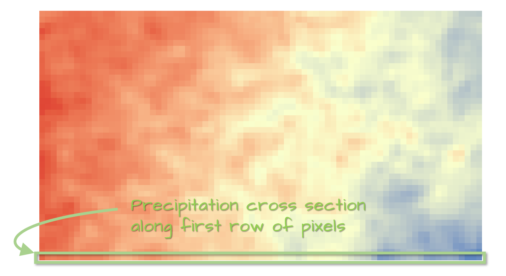
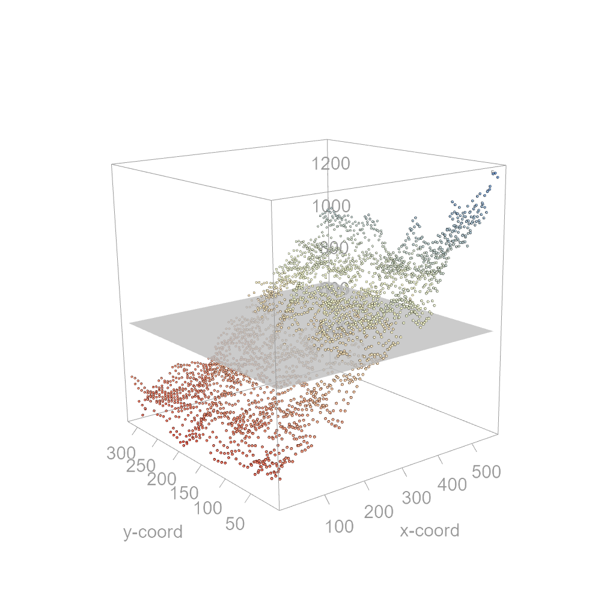
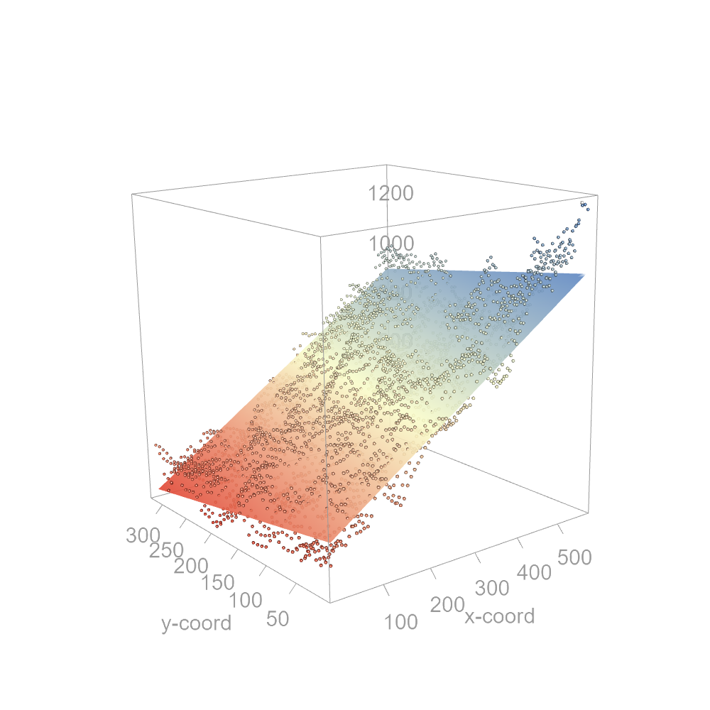
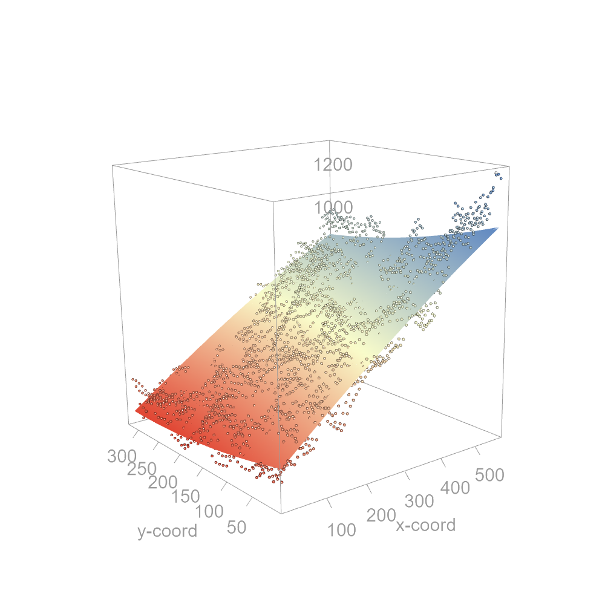

# Modeling Spatial Trends {#chp12_0}

## Introduction

Polynomial functions are a foundational tool for modeling spatial trends--particularly **first-order effects**--in spatial data. These models help describe how a variable changes across space due to absolute location, rather than proximity to neighboring values. In spatial statistics, modeling trend is often a critical first step before exploring second-order properties such as spatial autocorrelation.

Polynomial functions are parametric, meaning their form is predefined and their coefficients are estimated by fitting the model to data. In practice, they are used to: 

- Describe broad spatial variation in a variable.
- Remove global trend to expose residuals for further analysis.
- Support interpolation across unsampled locations.

In spatial analysis, polynomial functions typically consist of non-negative integer powers of the x and y coordinates. These models are most appropriate for **spatially continuous fields**--phenomena that can be measured at any location within the study area using ratio or interval scales (e.g., precipitation, elevation, population density). They are not suitable for discrete features such as crime events or tree locations.

While this chapter focuses on raster data, the principles of polynomial trend modeling apply across spatial data models, including point and polygon formats. The goal is to capture the **overall spatial pattern** without overfitting local variation. To that end, it is best to use the lowest polynomial order necessary to represent the trend.

In the sections that follow, we will: 

- Explore polynomial functions in one and two dimensions.
- Learn how to fit and evaluate models using regression techniques.
- Use residuals to assess model fit.


## Polynomial functions

Polynomial functions are mathematical models that seek to describe global trends in a dataset using the general form:

$$
\begin{equation}
\tag{1}
z_i = \beta \boldsymbol{s_i} + \varepsilon_i
\end{equation}
$$

where $z_i$ is a scalar of interest (e.g., precipitation, income, elevation, etc.) and $\boldsymbol{s_i}$ denotes location in one, two or n-dimensional space. The term $\varepsilon$ refers to the residuals--i.e., parts of the observed data not explained by the model (sometimes described as the error term in the field of statistics). The subscript $i$ reminds us that the value $z$ and its residual are a function of location $i$.

In spatial analysis, we usually work in two-dimensional space, hence location $s$ is defined by the coordinate pair (x, y). Thus, equation (1) can be expressed as a multivariate regression with the x and y coordinate values being two independent variables.

$$
\begin{equation}
\tag{2}
z_i = \beta_0 + \beta_1 x_i + \beta_2 y_i + \beta_3 x_i^2 + \beta_4 y_i^2 + ... + \varepsilon_i
\end{equation}
$$

Here, the ellipsis "..." is a placeholder for higher order polynomial values and interaction terms.

Fitting a polynomial function requires two steps: (1) defining the model (in this case the polynomial order)--this can be linear, quadratic, cubic, quartic, quintic, etc., (2) then fitting the model to the data using, for example, ordinary least squares regression methods.

Because distances in the x and y directions are assumed to be in the same units and scale (i.e., a unit change in x is equal to a unit change in y), it is best to work off a projected (aka Cartesian) coordinate system. Hence, the projected coordinates system should do a decent job in preserving distance within the study extent.

```{r echo = FALSE}
library(terra)
library(sf)
library(tukeyedar)
library(RColorBrewer)
library(dplyr)

r <- rast("./Data/kansas_precip_2020.tif")

grid <- rast(nrows=46, ncols=88, extent = ext(r), crs = crs(r))
r2 <- resample(r, grid, method = "bilinear")

c1 <- xFromCol(r2, 3)
c2 <- xFromCol(r2, ncol(r2)-9)
c3 <- yFromRow(r2, nrow(r2) -1)
c4 <- yFromRow(r2,  2)
crop_reg <- ext(c1, c2, c3, c4)
r2_crop  <- crop(r2, crop_reg)
# writeRaster(r2_crop, "kansas_precip_2020_crop.tif")

# Rescale axes to generate distances in km from lower-left corner
ext_orig <- ext(r2_crop)
ext(r2_crop) <- c(0, diff(ext(r2_crop)[1:2]), 0, diff(ext(r2_crop)[3:4]) ) / 1000

z <- as.vector(r2_crop[])
x <- xFromCell(r2_crop, 1:length(z))
y <- yFromCell(r2_crop, 1:length(z))

dat <- data.frame(x=x, y=y, z=z)

```

## Polynomial functions in one dimension

It may be best to first explore a polynomial function in one dimension. In what follows, we will work with the distribution of 2020 total precipitation for the state of Kansas (USA). The following figure shows a raster representation of the 2020 total precipitation (in mm) for Kansas.

```{r  fig121, echo=FALSE, fig.cap="Map of the total 2020 precipitation distribution for Kansas (USA)."}
knitr::include_graphics("img/poly_fig1.png")
```

However, we will first focus on the bottom row of pixels which will provide us with a one-dimensional (east-west) dataset.

```{r fig1211b, echo=FALSE, fig.cap="Row of pixels used to explore the trend along a one-dimensional space."}

```

A scatter plot of the precipitation values along the east-west gradient is shown next. Each point represents the precipitation value at a specific pixel location.

```{r fig122, fig.width=3.5, fig.height=4, results='hide', fig.cap="Scatter plot of precipitation along the east-west gradient defined in figure 12.2. ", echo = FALSE}
# One dimensional plot  (bottom) row ----------
dat2 <- dat[dat$y == 3.75, ]

# Fit 0th order polynomial (figure 3)
eda_lm(dat2, x=x, y=z, loe=FALSE, reg = FALSE, robust = FALSE, lm.col = "blue",
       sd = FALSE, mean.l = FALSE, ylab = "Precip", xlab = "x distance (km)",
       show.par = FALSE)
```

The simplest model that can be fitted to the data is the mean precipitation value--a constant. It can be visualized as a horizontal line. This is also known as a 0^th^ order polynomial model where:

$$
\begin{equation}
\tag{3}
Precipitation_i = \beta_0  x_i^0 + \varepsilon = \beta_0 + \varepsilon
\end{equation}
$$

Here, $\beta_0$ is nothing more than the mean precipitation value--756.8 mm in our working example. Recall that we are only focusing on the east-west precipitation values, hence the $y$ coordinate value is ignored in equation (3).

```{r fig123, fig.width=3.5, fig.height=4, results='hide',fig.cap="The mean precipitation fitted to the data. This is the simplest form of a polynomial function where the power is set to 0.", echo = FALSE}
# One dimensional plot  (bottom) row ----------
dat2 <- dat[dat$y == 3.75, ]

# Fit 0th order polynomial (figure 3)
eda_lm(dat2, x=x, y=z, loe=FALSE, reg = FALSE, robust = FALSE, lm.col = "blue",
       sd = FALSE, mean.l = FALSE, ylab = "Precip", xlab = "x distance (km)",
       show.par = FALSE)
abline(h = mean(dat2$z), col = "blue", lw = 2)
```

While such a simple model may not prove useful in modeling trends, it serves as a reference for how well other polynomial models perform. Model evaluation will be addressed later in this chapter.

It is clear from the plot that the precipitation is far from constant across the east-west slice of the data. It shows a distinct upward trend that may be better represented using a sloped line. We can modify the above model by augmenting the polynomial order:

$$
\begin{equation}
\tag{4}
Precipitation_i = \beta_0 + \beta_1 x_i^1 + \varepsilon_i
\end{equation}
$$

Equation (4) is mathematically defined as a first-order polynomial model, but it is more often described as a linear model. With the model defined a priori, the model is then fitted to the points.

```{r fig124, fig.width=3.5, fig.height=4, results='hide', fig.cap="A first-order polynomial function being fitted to the precipitation data. This is often referred to as a linear trend model.", echo = FALSE}
# Fit first-order polynomial
M1b <- lm(z ~ x, dat2)
dat2$res1 <- M1b$residuals

eda_lm(dat2, x=x, y=z, loe=FALSE, reg = TRUE, robust = FALSE, lm.col = "blue",
       sd = FALSE, mean.l = FALSE, ylab = "Precip", xlab = "x distance (km)",
       show.par = FALSE)
```

There are many approaches to finding the "best fit” with the most popular being the ordinary least squares method. This approach seeks to minimize the distance between the points and the fitted model when measured parallel to the y-axis. These are shown as red colored line segments in the following plot.

```{r fig125, fig.width=3.5, fig.height=4, results='hide', fig.cap="The first-order polynomial function (blue line) is shown with the residual lines (in red). The function is fitted to the data in such a way  to reduce the sum of the squared residual values.", echo=FALSE}

eda_lm(dat2, x=x, y=z, loe=FALSE, reg = TRUE, robust = FALSE, lm.col = "blue",
       sd = FALSE, mean.l = FALSE, ylab = "Precip", xlab = "x distance (km)",
       show.par = FALSE)
error_segs <- lapply(1:nrow(dat2),
       FUN = \(i) data.frame(x = dat2$x[i], y = c(predict(M1b)[i], dat2$z[i]),
                             row.names = NULL))
lapply(error_segs, \(x) lines(x, col = "red"))
```

The distance between the modeled line and each precipitation value is the residual ($\varepsilon_i$). This is part of the data not explained by the model.

Fitting the first-order polynomial to the data gives us the coefficients of 305.8 and 1.6 for $\beta_0$ and $\beta_1$ respectively.

The $\beta_1$ coefficient tells us that for every km increase in the (positive) x direction, precipitation increases by 1.6 mm. Note that the interpretation of the coefficient is dependent on the mapping units used. Typically, projection units are in meters or feet. But, when working at a scale like the State of Kansas, it is best to report changes in value as a function of larger mapping units such kilometers or miles.

Statisticians rarely stop at this stage when fitting a model to the data. It is good practice to plot the residuals against the x value. This diagnostic plot is useful in assessing if the overall trend in the data was properly characterized by our polynomial model. To help guide our eyes, we add a non-parametric curve to the data which does not make any assumptions about the pattern in the data. Here, we make use of a loess fit but note that many other non-parametric models can be used for this purpose.

```{r fig126, fig.width=3.5, fig.height=4, results='hide', fig.cap="The residuals are checked for any lingering pattern that may have been missed by the first-order polynomial function. A non-parametric line such as a loess is used to identify any pattern in the data.", echo=FALSE}
eda_lm(dat2, x=x, y=res1, loe=TRUE, reg = FALSE, robust = FALSE, lm.col = "blue",
       sd = FALSE, mean.l = FALSE, ylab = "Residuals", xlab = "x distance (km)",
       show.par = FALSE, asp = FALSE)

```

The diagnostic plot suggests that the first-order polynomial model we adopted does not fully capture the overall trend in the data. There appears to be some curvature in the residuals. This may suggest that we increase the polynomial order by an extra degree.

A second-order polynomial model in a one-dimensional space takes on the form:

$$
\begin{equation}
\tag{5}
Precipitation_i = \beta_0 + \beta_1 x_i + \beta_2 x_i^2 + \varepsilon_i
\end{equation}
$$

This model generates a curved fit often called a quadratic model.

```{r fig127, fig.width=3.5, fig.height=4, results='hide', fig.cap="A second-order polynomial function is fitted to the data. This is also referred to as a quadratic function.", echo=FALSE}
# Is second-order polynomial a better fit?
M2b <- lm(z ~ x + I(x^2), dat2)
dat2$res2 <- M2b$residuals

eda_lm(dat2, x=x, y=z, loe=FALSE, reg = TRUE, robust = FALSE, lm.col = "blue",
       sd = FALSE, mean.l = FALSE, ylab = "Precip", xlab = "x distance (km)",
       show.par = FALSE, poly = 2)
```

The residual diagnostic plot for this model shows a significant improvement in that the non-parametric fit (dashed blue line) does not show an overall trend in the data suggesting that a second-order polynomial model is a good fit for our data.

```{r fig128, fig.width=3.5, fig.height=4, results='hide', fig.cap="The lack of an overall pattern in the residuals suggests that the second-order polynomial function does a decent job in capturing the trend in precipitation.", echo=FALSE}
eda_lm(dat2, x, res2, loe=TRUE, reg = FALSE, lm.col = "blue",
       sd = FALSE, mean.l = FALSE, ylab = "Residuals", xlab = "x distance (km)",
       show.par = FALSE, asp = FALSE)
```

A unique characteristic of spatial data is the presence of autocorrelation which is very much apparent in both the original scatter plot and the diagnostic plot. One might be tempted to try and capture this non-random pattern in a polynomial model. For example, fitting a 20^th^ order polynomial model would do a decent job in capturing both the overall trend and localized variation as shown in the following plot.

```{r fig129, fig.width=3.5, fig.height=4, results='hide', fig.cap="An example of a higher polynomial order function fitted to the data. This is an example of an overfitted model.", echo=FALSE}
# Avoid high order polynomials
eda_lm(dat2, x=x, y=z, loe=FALSE, reg = TRUE, robust = FALSE, lm.col = "blue",
       sd = FALSE, mean.l = FALSE, ylab = "Precip", xlab = "x distance (km)",
       show.par = FALSE, poly = 20)
```

But, doing so is ill-advised--the model has 20 coefficients! Polynomial models are intended to capture general trends in the data. There are more sophisticated and specialized statistical methods used to capture localized spatial autocorrelation. A general rule of thumb is to avoid going above a 3^rd^ order polynomial model. Any higher order model is likely to capture some aspects of spatial autocorrelation.

## Transitioning from a one-dimensional to a two-dimensional space

The polynomial functions described in the earlier section can easily be extended to a two-dimensional space. Next, we fit polynomial functions to the full precipitation extent for the state of Kansas. This adds the y-coordinate variable to the model.

We learned that the 0^th^ order polynomial is a horizontal line in one dimensional space. For a two-dimensional space, this is a horizontal plane that can be defined as:

$$
\begin{equation}
\tag{6}
Precipitation_i = \beta_0 + \beta_1 x_i^0  + \beta_2 y_i^0  + \varepsilon_i = \beta^{'} + \varepsilon_i
\end{equation}
$$

where $\beta^{'} = (\beta_0 + \beta_1 + \beta_2)$ is the mean precipitation for the entire study extent--660 mm in our working example. The following figure shows this plane in a three-dimensional space.

```{r fig1210a, echo=FALSE, fig.cap="A 0th order polynomial function fitted to the full two-dimensional precipitation data. The z-axis is assigned the precipitation variable."}

```


An east-west trend is apparent in the three-dimensional scatter plot suggesting that we should seek a first-order polynomial, at the very least. The model takes on the form:

$$
\begin{equation}
\tag{7}
Precipitation_i = \beta_0 + \beta_1 x_i  + \beta_2 y_i  + \varepsilon_i
\end{equation}
$$

The model defines a plane that can be tilted in any direction. As was the case with the one-dimensional dataset, we can leverage the least squares method to fit the model to the data. This results in the following coefficients:

$$
\begin{equation}
\tag{8}
Precipitation_i = 402 + 1.15 x_i - 0.45 y_i  + \varepsilon_i
\end{equation}
$$

The coefficients tell us by how much the precipitation changes along the x and y coordinate directions. In our working example, precipitation increases by 1.15 mm in the x direction (west to east) and decreases by 0.45 mm in the y direction (south to north). The precipitation gradient is greater in the x-direction than in the y direction. The following figure shows a three-dimensional rendering of the plane.

```{r fig1211, echo=FALSE, fig.cap="A first-order polynomial function fitted to the two-dimensional precipitation data."}

```

The same model can be viewed as a two-dimensional raster where each pixel represents the modeled precipitation.

```{r fig1212, fig.width=7, fig.height=3.25, results='hide', fig.cap="A raster view of the first-order polynomial function shown in Figure 11.12.", echo = FALSE}
M1 <- lm(z ~ x + y, dat)
dat$res1 <- resid(M1)
fit1 <- r2_crop
fit1[] <- M1$fitted.values
plot(fit1, col = colorRampPalette(c("#E14533","#FAFDCB", "#5E87C2"))( 100 ) )
```

How well does the first-order polynomial fit our data? We may first want to look at the residuals.

```{r fig1213, fig.width=7, fig.height=3.25, results='hide', fig.cap="The residuals from the fitting of the first-order polynomial function. Note the cluster of low precipitation values revealed by removing the trend.", echo = FALSE}
res1 <- r2_crop
res1[] <- M1$residuals
plot(res1, col = colorRampPalette(c("#E14533","#FAFDCB", "#5E87C2"))( 100 ))
```

The overall trend observed in the original raster is no longer obvious. However, subtle trends are more difficult to make out when viewing a two-dimensional dataset than a one-dimensional dataset. A more effective way to assess model fit in two-dimensional space is to split the residuals into their x and y coordinate components by plotting the residuals as a function of x and y respectively.

```{r fig1214, fig.width=7, fig.height=3.25, results='hide', fig.cap="The residuals from the fitting of the first-order polynomial function as viewed from the x-coordinate axis and the y-coordinate axis.",echo = FALSE}
OP <- par(mfrow = c(1,2))
eda_lm(dat, x, res1, asp = FALSE, reg = FALSE, loe = TRUE, xlab="X-coordinate",
       show.par = FALSE,sd = FALSE, mean.l = FALSE, ylab = "Residuals",
       loess.d = list(span = 0.5, family = "symmetric") )
eda_lm(dat, y, res1, asp = FALSE, reg = FALSE, loe = TRUE, xlab="Y-coordinate" ,
       show.par = FALSE,sd = FALSE, mean.l = FALSE, ylab = "Residuals",
       loess.d = list(span = 0.5, family = "symmetric"))
par(OP)
```

The plots suggest a very mild curvature in the residuals along the x coordinate. A similar, but more complex curvature can be observed along the y-coordinate. It may be worthwhile to augment the function by another polynomial order giving us a second-order polynomial function to see if it removes some of these trends. Such a function is also called a quadratic polynomial function. It takes on the form:

$$
\begin{equation}
\tag{9}
Precipitation_i = \beta_0 + \beta_1 x_i  + \beta_2 y_i + \beta_3 x_i^2  + \beta_4 y_i^2 + \beta_5 x_iy_i + \varepsilon_i
\end{equation}
$$

Note that in addition to adding the squared coordinate values, the function also adds the interactive terms $xy$. The interaction term captures situations where the coefficients for $x$ or $y$ are no longer a constant. For example, if the effect of the x coordinate value on precipitation changes as a function of changing y coordinate values, then x's coefficient can no longer be deemed a constant. This is captured by the $x_iy_i$ term in equation 9.

The least squares method can be used to fit the function to the data. In our example, this gives us:

$$
\begin{equation}
\tag{10}
Precipitation_i = 378 + 1.43 x_i -0.66 y_i -0.0003 x_i^2 +0.0013 y_i^2 -0.0005 x_iy_i + \varepsilon_i
\end{equation}
$$

The coefficients suggest that the $x_i$ and $y_i$ coordinate values have a greater influence on the estimate of precipitation than their $x_i^2$ and $y_i^2$ counterparts despite the $x$ and $y$ terms being raised to the power of 2. Note too that the exceedingly small $x_iy_i$ coefficient suggests little to no interaction between the $x_i$ and $y_i$ coordinate values.

The next figure shows this curved surface in a three-dimensional space.

```{r fig1215, echo=FALSE, fig.cap="A second-order polynomial function fitted to the precipitation data. Note the slight curvature in the trend."}

```

The next figure shows the quadratic surface as a two-dimensional raster.

```{r fig1216, fig.width=7, fig.height=3.25, results='hide', fig.cap="A raster view of the second-order polynomial function shown in Figure 16.", echo = FALSE}
M2 <- lm(z ~ x + y + I(x^2) + I(y^2) + x*y, dat)
dat$res2 <- resid(M2)
fit2 <- r2_crop
fit2[] <- M2$fitted.values
plot(fit2, col = colorRampPalette(c("#E14533","#FAFDCB", "#5E87C2"))( 100 ) )
```

Note that the resulting residuals look barely different from those of the 1st order polynomial model.

```{r fig1218, fig.width=7, fig.height=3.25, results='hide', fig.cap="The residuals from the fitting of the second-order polynomial function.",echo = FALSE}
res2 <- r2_crop
res2[] <- M2$residuals
plot(res2, col = colorRampPalette(c("#E14533","#FAFDCB", "#5E87C2"))( 100 ))
```

It is therefore best to assess the goodness of fit by plotting the residuals against the x and y coordinate values.

```{r fig1219, fig.width=7, fig.height=3.25, results='hide', fig.cap="The residuals from the fitting of the first-order polynomial function as viewed from the x-coordinate axis and the y-coordinate axis.",echo = FALSE}
OP <- par(mfrow = c(1,2))
eda_lm(dat, x, res2, asp = FALSE, reg = FALSE, loe = TRUE, xlab="X-coordinate",
       show.par = FALSE,sd = FALSE, mean.l = FALSE, ylab = "Residuals",
       loess.d = list(span = 0.5, family = "symmetric") )
eda_lm(dat, y, res2, asp = FALSE, reg = FALSE, loe = TRUE, xlab="Y-coordinate" ,
       show.par = FALSE,sd = FALSE, mean.l = FALSE, ylab = "Residuals",
       loess.d = list(span = 0.5, family = "symmetric"))
par(OP)
```

The second-order polynomial is an improvement over the first-order polynomial, especially along the x-coordinate axis where the slight curvature observed in the first-order polynomial model's residuals is no longer apparent. Note that the range of residual values are also slightly less with the 2^nd^ order function versus the first-order function.

Mathematically, there is no limit to the polynomial order you choose. For example, you could explore a third order polynomial function (a cubic polynomial) or even a fourth order polynomial function (a quartic polynomial). But, as was forewarned with the one-dimensional analysis presented earlier in this chapter, doing so increases the chance of overfitting the data. Recall that the purpose of modeling the trend is to capture the data's *overall* pattern. Polynomial functions are not well suited to capturing *local* variability in the data.

One option that may help eliminate the need for higher polynomial orders is to transform (aka re-express) the variable $z_i$. Transforming the data can render a curvilinear function straight (or flat in a two-dimensional space). Transforming the variable may also be scientifically justified. There are many datasets that benefit from a non-linear scale. For example, earthquake magnitudes are measured on a log scale and some count datasets can benefit from a square root transformation.

## Evaluating a model’s goodness of fit

The diagnostic plots have, so far, been visual. We can adopt a more rigorous and systematic approach to evaluating how well the functions fit the data. A popular statistical measure of "fit" is the coefficient of determination, $R^2$. It is computed by subtracting one from the ratio of the sum of residuals squared in the fitted model to the sum of residuals squared one would get if we had fitted the mean value.

$$
\begin{equation}
\tag{11}
R^2 = 1 - \frac{\sum(residuals_{model})^2}{\sum(residuals_{mean})^2}
\end{equation}
$$

If the residuals from the model are smaller than those we would have gotten if we adopted the simpler mean model, $R^2$ ends up being large. $R^2$ ranges from 0 (no improvement whatsoever over the mean) to 1 (a perfect fit where the residuals from the fitted model are zero). In our working example, the first-order polynomial model resulted in an $R^2$ of 0.87. The second-order polynomial resulted in an $R^2$ of 0.90–a slight improvement over the first-order polynomial. Note that the $R^2$ value is sometimes reported as a percentage rather than a fraction.

## A note about adopting traditional statistical measures of significance to spatial functions

Because underlying residuals are likely to exhibit spatial autocorrelation, traditional methods used to assess "statistical significance" of a model and its coefficient should be avoided. For example, the cluster of low residual values in the eastern part of Kansas is a good indication that spatial autocorrelation is present in our data.

## Summary

This chapter introduces polynomial functions as a parametric tool for modeling first-order spatial effects--the broad, location-driven variation in spatial data. Polynomial models help describe global trends in continuous fields such as precipitation or elevation, and are commonly used to:

- Quantify spatial trend across one- or two-dimensional space.
- Remove global variation to expose residuals for further analysis.
- Support interpolation at unsampled locations.

Modeling spatial trend can be a critical first step in spatial statistics. Once global variation is accounted for using polynomial functions, the residuals can be analyzed to uncover second-order properties such as spatial autocorrelation. 
