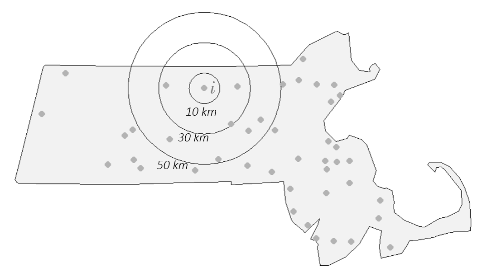
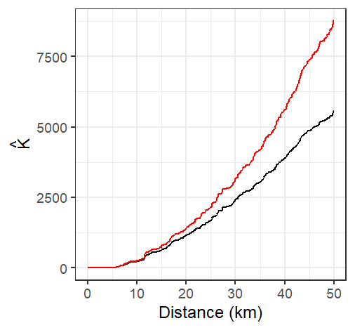

# Second-Order Point Pattern Analysis: Modeling Distance  {#chp15_0}

## Introduction

An alternative to the *density-based methods* explored thus far are the **distance-based methods** for analyzing spatial point patterns. These approaches shift the focus from how points are distributed relative to the study area (a *first-order property*) to how points are distributed **relative to one another**--a hallmark of **second-order analysis**. This shift enables us to explore whether events exhibit spatial interaction, such as **clustering** or **dispersion**, across various spatial scales.

Distance-based methods are particularly useful when the goal is to assess whether the observed pattern deviates from what would be expected under complete spatial randomness (CSR), a benchmark model in spatial statistics. Rather than estimating intensity across space, these methods examine the spatial arrangement of points directly through inter-point distances.

In the sections that follow, we introduce three widely used distance-based techniques:

- **Average Nearest Neighbor (ANN)**
- **Ripley’s K and L functions**
- **The Pair Correlation Function (PCF)**

Each of these methods provides a different lens through which to assess the spatial structure of a point pattern, and each is sensitive to different aspects of spatial interaction.

## Average Nearest Neighbor

**Average Nearest Neighbor (ANN)** analysis measures the average distance from each point in a study area to its nearest neighboring point. This provides a simple yet powerful summary of the spatial arrangement of points, helping to distinguish between clustered, random, or regularly spaced patterns. 

In the example below, the average nearest neighbor distance for all points is 13,295 meters.

```{r f11-ppp-dist, echo=FALSE, fig.cap="A subset of distances between each point and its closest point. For example, fig.height=3.0, fig.width=5, message=FALSE, warning=FALSE, the point closest to point 3 is point 4 which is 16,616 meters away.", results="asis"}
library(ggplot2)
library(sf)
library(spatstat)
library(gridExtra)

# Load Starbucks point locations
S  <- st_read("./Data/Walmarts.shp")
P <- as.ppp(S)
marks(P) <- NULL


mytheme <- gridExtra::ttheme_default(
    core = list(fg_params=list(vjust=0, x=0.4, cex=0.5,lineheight = 5)),
  #  gpar.coretext = gpar(fontsize = 1, lineheight = 0.1, cex = 0.1),
    colhead = list(fg_params=list(cex = 0.4)),
    rowhead = list(fg_params=list(cex = 0.4)))

ANN <- nndist(P, k=1)
NN <- nnwhich(P, k =1)
ddf <- data.frame(From = 1:length(NN),  To = NN, Distance = round(ANN,2))
ddf.split <- cbind(ddf[1:10,], ddf[11:20,])
d <- tableGrob(ddf.split,theme = mytheme, rows=NULL)

PP <- ggplot(aes(x = x, y = y), data = as.data.frame(P)) + theme(legend.position = "none") +
  geom_point(data = as.data.frame(P), mapping=aes(x=x, y=y), size=1.5, shape=16, colour="grey30") +
  coord_equal() + labs(x="",y="") +
  geom_text(aes(label=1:P$n),hjust=-0.4, vjust=-0.4, size=2) +
  theme(plot.margin = unit(c(0, 0, 0, 0), "cm"), axis.text=element_text(size = 4) ) +
          scale_x_continuous(breaks=seq(0,10,2)) + scale_y_continuous(breaks=seq(0,10,2))

grid.arrange(PP,d, ncol=2)

```

### Extending the Concept: Higher-Order Neighbors

While the basic ANN statistic captures only the nearest neighbor relationship, extending the concept to include second, third, and higher order neighbors reveals more nuanced spatial structures. This produces a curve that reflects how inter-point distances change with neighbor order.

```{r f11-ANN-plot,fig.cap="ANN values for different neighbor order numbers. For example, the ANN for the first closest neighbor for all points is 13,295 meters; the ANN for the 2nd closest neighbor for all points is 18850 meters, and the ANN for the 43rd closest neighbor (the furthest neighbor) for all points is 182,818 meters,and so forth.", fig.height=2, fig.width=3.5, echo=FALSE, message=FALSE, warning=FALSE}

ANN <- apply(nndist(P, k=1:(P$n-1)),2,FUN=mean) # Compute ANN for each order
d.f <- data.frame(Order=1:(P$n-1), ANN=ANN)
ggplot( aes(x=Order, y=ANN), data=d.f) +geom_line() + geom_point(size=1.5, shape=16)+
  theme(plot.margin = unit(c(0, 0, 0, 0), "cm"), axis.text=element_text(size = 8),
        axis.title = element_text(size=8 ) )

```

The shape of the ANN curve provides insight into the spatial structure of the pattern. A steep initial slope followed by a gradual increase may indicate tight clustering, while a more linear increase suggests regular spacing.

To illustrate how ANN curves vary with different spatial arrangements, consider three point patterns of 20 points each:

- A single cluster
- A dual cluster
- A random scatter

```{r f11-diff-patterns, fig.cap="Three different point patterns: a single cluster, a dual cluster and a randomly scattered pattern.", fig.height=2, fig.width=4.5, echo=FALSE}

library(spatstat)
win <- owin(c(0,10),c(0,10))

set.seed(12)
x <- rnorm(20, 5,0.3)
set.seed(14)
y <- rnorm(20,5,0.3)
P.cl <- ppp(x,y,window=win)

set.seed(6)
x <- c(rnorm(10, 3,0.5), rnorm(10,6,0.5))
set.seed(34)
y <- c(rnorm(10, 3,0.5), rnorm(10,6,0.5))
P.cl2 <- ppp(x,y,window=win)

set.seed(673)
P.rnd <- rpoint(20, win=win)

ann.cl <- apply(nndist(P.cl, k=1:(P.cl$n-1)),2,FUN=mean)
ann.cl2 <- apply(nndist(P.cl2, k=1:(P.cl2$n-1)),2,FUN=mean)
ann.rnd <- apply(nndist(P.rnd, k=1:(P.rnd$n-1)),2,FUN=mean)

OP <- par(mfrow=c(1,3), mar=c(1,1,1,0))
 plot(P.cl, pch=20, main="",cols=rgb(0,0,0,.5))
 plot(P.cl2, pch=20, main="",cols=rgb(0,0,0,.5))
 plot(P.rnd, pch=20, main="",cols=rgb(0,0,0,.5))
par(OP)

```

The following figure illustrates how the ANN curve varies across three spatial arrangements, highlighting the sensitivity of ANN to clustering structure.

```{r f11-diff-ANN-plots, fig.cap="Three different ANN vs. neighbor order plots. The black ANN line is for the first point pattern (single cluster); the blue line is for the second point pattern (double cluster) and the red line is for the third point pattern.", fig.height=2, fig.width=4.0, echo=FALSE}
OP <- par(mar=c(1.4,1.2,1,0) )
plot(1:19, ann.cl, type="b", ylim=c(0, max(ann.cl,ann.rnd, ann.cl2)), cex=.5, pch=16,xaxt="n",yaxt="n",
     xlab="", ylab="")
axis(1, seq(0,20,5),cex.axis=.5,xlab="Neighbor order", cex.lab=.5,padj=-3,tck=-0.02)
mtext("Neighbor order", 1, cex=.7, line=0.5)
axis(2, seq(0,round(max(ann.cl,ann.rnd)), length.out=4),cex.axis=.5,xlab="Neighbor order", cex.lab=.5,las=2,
     hadj=-1.6, ,tck=-0.02)
mtext("ANN", 3, cex=.7, line=0, at=0)
 lines(1:19, ann.rnd, type="b", col="red", cex=.5, pch=16)
 lines(1:19, ann.cl2, type="b", col="blue", cex=.5, pch=16)
par(OP)

```

- The black line (single cluster) shows short distances across all neighbor orders, indicating tight clustering.
- The blue line (dual cluster) shows intermediate distances, reflecting the presence of two separate clusters.
- The red line (random scatter) shows longer distances overall, consistent with a more dispersed arrangement.

The perceived spatial structure of a point pattern is highly sensitive to the definition of the study area. In the example below, the same clustered pattern is shown within two different bounding boxes:

```{r f11-diff-ppp02, fig.cap="The same point pattern presented with two different study areas. How differently would you describe the point pattern in both cases?", fig.height=2, fig.width=4.0, echo=FALSE}
set.seed(12)
x <- rnorm(20, 5,0.3)
set.seed(14)
y <- rnorm(20,5,0.3)
P.cl <- ppp(x,y,window=win)
win2 <- owin(range(x), range(y))
P2.cl <- ppp(x,y, window=win2)
OP <- par(mfrow=c(1,2), mar=c(1,1,1,0))
 plot(P.cl, pch=20, main="",cols=rgb(0,0,0,.5), cex=0.8)
 plot(P2.cl, pch=20, main="",cols=rgb(0,0,0,.5), cex=0.8)
par(OP)
```

When the study area is tightly fitted around the cluster, the pattern appears more dispersed. This highlights the modifiable areal unit problem (MAUP), a key concern in spatial analysis.

ANN analysis assumes that the underlying point process is stationary—that is, the intensity of the process does not vary across space. If the process is non-stationary, observed clustering may reflect underlying environmental gradients or covariates rather than true inter-point interaction.

Correcting for non-stationarity when performing hypothesis tests is discussed in the next chapter.

### Testing for Complete Spatial Randomness

#### Analytical approach

The analytical approach to testing for Complete Spatial Randomness (CSR) using the Average Nearest Neighbor (ANN) statistic involves comparing the observed mean nearest neighbor distance to the expected mean distance under a CSR model. The null hypothesis assumes that the observed point pattern is a realization of a spatially uniform and independent process.

Under CSR, the expected mean nearest neighbor distance is:

$$
ANN_{expected}=\dfrac{1}{2\sqrt{n/A}}
$$
where:

- $n$ is the number of points,
- $A$ is the area of the study region

The test statistic is the ratio:

$$
R = \frac{ANN_{observed}}{ANN_{expected]}}
$$

Interpretation:

- $R < 1$: suggests clustering
- $R > 1$: suggests dispersion
- $R \approx 1$ suggests consistent with a completely random process

To assess statistical significance, a z-score is computed:

$$
z = \frac{ANN_observed - ANN_expected}{SE}
$$
where the standard error (SE) of the expected distance under CSR is:

$$
SE = \frac{0.26136}{\sqrt{n\lambda}}
$$
This z-score is then compared to a standard normal distribution to determine whether the observed pattern significantly deviates from CSR.

While analytically elegant, the ANN hypothesis test has several limitations that constrain its interpretive power:

- Sensitivity to Study Area Definition: 
   The expected distance depends on the area $A$ which must be defined explicitly. 
- Shape Effects: 
   The formula assumes a regular-shaped study region. Irregular boundaries distort the expected distance and introduce edge effects, where points near the boundary have artificially inflated nearest neighbor distances.
- Stationarity Assumption:
   The test assumes a stationary process--i.e., constant intensity across space. If the underlying process is inhomogeneous, with point density varying due to environmental or socioeconomic factors, clustering may reflect first-order effects rather than true inter-point interaction.
   
#### A better approach: a Monte Carlo test

While the analytical approach to ANN hypothesis testing offers a convenient benchmark for assessing spatial randomness, its reliance on idealized assumptions--such as **uniform study area shape**--can limit its applicability in real-world contexts. When such assumptions are violated, the analytical test may yield misleading results. To address these limitations, spatial analysts often turn to simulation-based methods, such as **Monte Carlo techniques**, which offer a more flexible and empirically grounded framework for hypothesis testing. These methods allow us to generate synthetic point patterns under a specified null model and compare our observed statistic to the distribution of simulated outcomes, providing a more robust basis for inference.

The Monte Carlo technique involves three steps:

 * First, we postulate a process--our null hypothesis, $Ho$. For example, we hypothesize that the distribution of Walmart stores is consistent with a completely random process (CSR). 

 * Next, we simulate many realizations of our postulated process and compute a statistic (e.g. ANN) for each realization.
 
 * Finally, we compare our observed data to the patterns generated by our simulated processes and assess (via a measure of probability) if our pattern is a likely realization of the hypothesized process. 
 
Using the Walmart store distribution example, we randomly re-position the location of the Walmart points 1000 times (or as many times computationally practical) following a completely random process--our *hypothesized* process, $Ho$--while making sure to keep the points confined to the study extent (the state of Massachusetts).

```{r f12-sim-points-example, echo=FALSE, fig.cap = "Three different outcomes from simulated patterns following a CSR point process. These maps help answer the question *how would Walmart stores be distributed if their locations were not influenced by the location of other stores and by any local factors (such as population density, population income, road locations, etc...)*"}
knitr::include_graphics("img/Sample_rnd_pts.png")
```

For each realization of our process, we compute an ANN value. Each simulated pattern results in a different ANN value under CSR. These values form an empirical distribution representing the null hypothesis. We plot the simulated ANN value with a histogram (this is our $Ho$ sample distribution), then compare our observed ANN value of 13,294 m to this distribution.

```{r f12-walmart-MC-hist, echo=FALSE, fig.cap = "Histogram of simulated ANN values (from 1000 simulations). This is the sample distribution of the null hypothesis, ANN~simulated~ (under CSR). The red line shows our observed (Walmart) ANN value. About 32% of the simulated values are greater (more extreme) than our observed ANN value."}
knitr::include_graphics("img/ANN_hist.png")
```

By using the same study region in each simulation, Monte Carlo methods automatically account for edge effects and irregular study area shapes—issues that are difficult to correct analytically.


#### Extracting a p-value from a Monte Carlo test

The **Monte Carlo p-value** represents the proportion of simulated patterns that yield a test statistic more extreme than the observed one, under the null hypothesis. Specifically, we count how many simulated values are **more extreme** than the observed statistic--either greater or smaller, depending on the direction of the test. For a **one-sided** test, the empirical p-value is calculated as:

$$
p = \dfrac{N_{extreme}+1}{N+1}
$$

where *N~extreme~* is the number of simulated values more extreme than our observed statistic, and $N$ is the total number of simulations. The $+1$ is added to ensure that the p-value can never be exactly 0.

A practical and more generalized form of the equation looks like this:

$$
p = \dfrac{min(N_{greater}+1 , N + 1 - N_{greater})}{N+1}
$$

where $min(N_{greater}+1 , N + 1 - N_{greater})$ is the smallest of the two values $N_{greater}+1$ and $N + 1 - N_{greater}$, and $N_{greater}$ is the number of simulated values greater than the observed value. It's best to implement this form of the equation in a scripting program to avoid the need to *visually* seek the side of the distribution closest to our observed statistic.

For example, if we ran 1000 simulations in our ANN analysis and found that 319 of those were more extreme (on the right side of the simulated ANN distribution) than our observed ANN value, our p-value would be (319 + 1) / (1000 + 1) or **p = 0.32**. This can be interpreted as *"there being a 32% chance of observing a test statistic as extreme as ours if the null hypothesis (CSR) were true."* This suggests that rejecting the null hypothesis that a CSR process could have generated our observed Walmart point distribution may be unwarranted. But this is not to say that the Walmart stores were in fact placed across the state of Massachusetts randomly (it's doubtful that Walmart executives make such an important decision purely by chance), all we are saying is that a CSR process *could* have been one of **many** processes that generated the observed point pattern.

If a two-sided test is desired, then the equation for the $p$ value takes on the following form:

$$
2 \times \dfrac{min(N_{greater}+1 , N + 1 - N_{greater})}{N+1}
$$
 
where we are simply multiplying the one-sided p-value by two.

Monte Carlo tests provide a robust alternative to analytical methods, especially when regular study area shape are violated. By simulating point patterns under realistic null models, we can better assess the plausibility of observed spatial structures.

### Controlling for First-Order Effects in Second-Order Analysis

The assumption of CSR provides a useful baseline for spatial analysis, but it's often unrealistic in real-world settings. Many real-world spatial processes exhibit both *first-order effects* and *second-order effects*. When first-order effects are present, the underlying point process is *non-stationary* or **inhomogeneous**. In such cases, hypothesis tests must be adjusted to account for this spatial heterogeneity. 

```{r f12-walmart-pop, echo=FALSE, fig.cap="Walmart store distribution overlayed on top of a population density layer. Could population density distribution explain the distribution of Walmart stores?"}
knitr::include_graphics("img/Pop_dens.png")
```

For example, if there are reasons to believe that the placement of Walmart stores can be influenced by the distribution of the population density (a first-order effect) we must account for this spatial heterogeneity when testing for clustering or dispersion. This involves simulating point patterns that follow the same population density distribution and comparing the observed pattern to these simulations using Monte Carlo (MC) techniques.

```{r f12-walmart-pop-sim, echo=FALSE, fig.cap = "Examples of simulated point patterns generated under a non-stationary process, with population density serving as the spatial intensity function."}

knitr::include_graphics("img/Non_hom_2.png")
```

Note that even though we are no longer referring to a CSR point process, we are still treating this as a random point process since the points are randomly placed *following* the underlying population density distribution. Using the  Monte Carlo (MC) techniques used with an earlier section, we can simulate thousands of such point patterns (following the population density) and compare our observed ANN value to those computed from our MC simulations. 

```{r f12-ann-hetero-hist, echo=FALSE, fig.cap="Distribution of ANN values under a null model where population density governs point intensity."}
knitr::include_graphics("img/ANN_pop_dens.png")
```

In this example, our observed ANN value falls far to the right of our simulated ANN values indicating that our points are more dispersed than would be expected had population density distribution been the sole driving process. The percentage of simulated values more extreme than our observed value is 0% (i.e. a p-value $\backsimeq$ 0.0). 

Another plausible hypothesis is that median household income influenced the placement of Walmart stores.

```{r f12-ann-income, echo=FALSE, fig.cap="Observed Walmart store locations overlaid on a map of median household income distribution.", out.width=450}
knitr::include_graphics("img/Median_income_map.png")
```

Running an MC simulation using median income distribution as the underlying intensity process yields an ANN distribution where about 16% of the simulated values are more extreme than our observed ANN value (i.e., one-sided p-value = 0.16):

```{r f12-ann-income-hist, echo=FALSE, fig.cap="Histogram of ANN values from simulated point patterns generated under a median income-based intensity model."}
knitr::include_graphics("img/Median_income_results.png")
```

Note that we now have two competing hypotheses: a CSR/IRP process and median income distribution process. Both cannot be rejected. This serves as a reminder that a hypothesis test cannot tell us if a *particular* process is *the* process involved in the generation of our observed point pattern; instead, it tells us that the hypothesis is one of *many* plausible processes.

It's important to remember that the ANN tool is a *distance* based approach to point pattern analysis. Even though we are randomly generating points following some underlying probability distribution map we are still concerning ourselves with the *repulsive*/*attractive* forces that might dictate the placement of Walmarts *relative* to one another--i.e. we are *not* addressing the question "can some underlying process explain the X and Y placement of the stores" (addressed in section \@ref(PPM)). Instead, we are controlling for the 1^st^ order effect defined by population density and income distributions. 

### Controlling for Second-Order Effects in First-Order Analysis

While it is common practice to control for first-order effects when testing for second-order spatial interaction, the reverse (testing for first-order effects while accounting for second-order interaction) is far less straightforward. Most hypothesis tests for first-order effects assume that points are independently distributed, an assumption that is violated when second-order effects (such as clustering or inhibition) are present.

In such cases, model-based approaches offer a more appropriate framework. These methods jointly estimate both the intensity (first-order structure) and the interaction between points (second-order structure). One example involves models where “parent” points are first generated (often following a homogeneous or inhomogeneous Poisson process) and “child” points are then clustered around each parent. However, in practice, only the child locations are used in the Monte Carlo tests. 

These techniques go beyond the scope of this course. For now, it is important to recognize that second-order effects can confound first-order inference and that careful model specification is essential when both types of spatial structure are present.

## K and L functions

The ANN statistic is one of several distance-based measures used to describe spatial point patterns. While ANN focuses on the distance to the n^th^ closest neighbor, the **K and L functions** offer a more comprehensive view by considering **all inter-point distances** up to a given threshold. This makes it particularly useful for detecting clustering or regularity across multiple spatial scales.

In the sections that follow, we explore how the K and L functions are computed, interpreted, and used in hypothesis testing.

### K function

The **K function** summarizes the spatial dependence between points by measuring the expected number of points within a given distance of each point, normalized by the overall point density. 

The K function is a theoretical property of the underlying point process. However, as is the case with a theoretical property of a process, we rely on the observed pattern (one of many realizations of the underlying process) to **estimate** this function.

```{r f11-K0, echo=FALSE, fig.cap="Illustration of how the K function summarizes the number of points within a specified distance: Three concentric circles are drawn around point $i$, and the number of neighboring points within each radius is tallied. In this example, no points fall within 10 km of $i$, three points fall within 30 km, and seven points fall within 50 km. "}

```

The K function estimate, $\hat{\lambda}$, can be computed from an observed point pattern as follows:

$$
\hat{K}(d) = \frac{A}{n(n-1)} \sum_{i=1}^{n} \sum_{j \neq i}^n I(d_{ij} \leq d)
$$

where:

- $i$ refers to the **reference point** from which distanced $d$ are measured.
- $j$ refers to the **other points** in the pattern that are being evaluated to see whether they fall within a circle of radius $d$ centered on $i$.
- $d$ is the search distance for which we are counting neighboring points.
- $d_{ij}$ is the distance between point $i$ and point $j$.
- $I(d_{ij} \le d)$ is an indicator function that equals 1 if $d_{ij} \le d$ and 0 otherwise.
- $\sum_{i=1}^{n}$ is the outer summation It means "for each point $i$ from the first point to the $n$^th point, do the following ..."
- $\sum_{j \neq i}$ is the inner summation. For the current point $i$ selected by the outer summation, sum the results of the indicator function over all points $j$ in the dataset, excluding the case where $j$ is the same as $i$.
- $n(n-1)$ in the denominator is normalizing factor. It represents the **total number of ordered pairs of distinct points** in the dataset. Dividing the total count from the double summation by $n(n-1)$ gives the observed fraction of pairs separated by a distance less than or equal to $d$.
- $A$ is the area of the study region. Multiplying the proportion by $A$ **scales the result into units of area**, which makes comparison of the K function between datasest and theoretical K functions possible.

The units of the K function is area whose units are usually defined by the point layer's coordinate system.

You might see K function sometimes expressed as,


$$ \widehat{K}(d) = \frac{1}{\widehat\lambda n} \sum_{i=1}^{n} \sum_{j \neq i} I(d_{ij} \leq d) $$
Note that the intensity estimator used here, $\hat{\lambda} = (n-1) / A$, is slightly different from the more intuitive "natural" estimator, $\hat{\lambda} = n/A$, that we've used previously. This is a deliberate statistical adjustment related to the goal of the K-function. The K-function describes the characteristics of a pattern **from the perspective of the events themselves**, looking at the distances between them. Think of it this way: when we stand at a specific event $i$ and count its neighbors, we are looking at the density of the other $n-1$ events in the study area $A$. 

```{r f11-K1, echo=FALSE, fig.cap="The K function estimated from the Walmart stores point distribution in MA for 512 distinct distances $d$ ranging from 0 km to 50 km"}
knitr::include_graphics("img/K_function.png")
```


A few important considerations are to be taken:

- The K function, as presented here, assumes a homogeneous underlying first-order process given that $\hat{\lambda}$ is assumed uniform for all locations with the study extent.
- The underlying process is assumed **isotropic** meaning that the relationship between points is a function of distance and not direction.
- Given that distance measurements are to be performed, coordinate systems used with the point pattern needs to preserve distance unless geodesic distances are to be computed.


The K-function can be quite sensitive to edge effects. A correction is often applied to $\hat{K}$ to correct for this bias. A standard and widely used method applies an **isotropic correction** weight that is the proportion of the **circumference** of the circle centered on reference point $i$ with radius $d$ that lies within the study area (e.g. the state of Massachusetts in our working example). The corrected K function estimator takes the form:

$$
\hat{K}(d) = \frac{A}{n(n-1)} \sum_{i=1}^{n} \sum_{j \neq i} \frac{I(d_{ij} \leq d)}{w_{ij}}
$$


where $w_{ij}$ is the isotropic correct weight that is the proportion of the circumference of the circle centered at $i$ with radius $d$ that lies within the study area $A$. Note that the proportion is that of the circle's **perimeter length** and not the circle's area.

```{r f11-K2, echo=FALSE, fig.cap="The K-function estimated from the Walmart stores point distribution in MA (shown in black), and the isotropic edge corrected K function for the same point layer (shown in red) "}

```

Under the assumption of **Complete Spatial Randomness (CSR)**, the expected value of the K function is:

$$
K_{expected}(d) = \pi d^2
$$

This provides a benchmark for comparison. 

If the observed K function exceeds this expected value, it suggests **clustering** of points at distance $d$. If it falls below, it suggests or **dispersion** of points at distance $d$.

```{r f11-K3, echo=FALSE, fig.cap="The K-function estimated from the Walmart stores point distribution in MA (shown in black), and the isotropic edge corrected K function for the same point layer (shown in red). The thick grey line represents the theoretical K function under the assumption of **Complete Spatial Randomness. Note how not correcting for edge effect can mis-characterize the nature of the point pattern. The uncorrected K function suggests a pattern more disperesed than expected under CSR assumption for all distance values while the isotropic weighted K function suggests clustering,"}
knitr::include_graphics("img/K_function_iso_theo.png")
```

### L function

One limitation with the K function is that the shape of the function tends to curve upward (quadratically) making it difficult to see small differences between $K$ and $K_{expected}$. To address this, the **L function** is used as a variance-stabilizing transformation. A form of the L function follows:

$$
L=\sqrt{\dfrac{K(d)}{\pi}}-d
$$
Technically, the fundamental L function is written as $L=\sqrt{\dfrac{K(d)}{\pi}}$, however, the **centered** version of the function presented above has the benefit of rotating the plot such that the baseline under CSR is rendered horizontal. This provides more separation between the estimated K functions an and the theoretical K function across the range of distances.

Under CSR,  $L_{expected}(d) \approx 0$. Deviations from zero indicate departures from randomness: 

- $L(d) > 0$: clustering at distance $d$ 
- $L(d) < 0$: dispersion at distance $d$

```{r f11-L, echo=FALSE, fig.cap="L function rendering of the K function plot shown above. Both the edge corrected (red line) and standard L functions (black line) are shown. The theoretical L function under CSR is shown as a horizontal line centered on 0. "}
knitr::include_graphics("img/L_function.png") 
```

The L function suggests that Walmart locations are more dispersed than expected under CSR up to a distance of 12 km but more clustered at distances greater than 12 km.

### Monte Carlo test for the K and L functions

MC techniques are not unique to average nearest neighbor analysis. In fact, they can be implemented with many other statistical measures including the K and L functions. However, unlike the ANN analysis, the K and L functions consist of multiple test statistics (one for each distance $d$). This results in not one but in as many number of simulated distributions as there are distances for which K and L are computed. Typically, these distributions are presented as *envelopes* superimposed on the estimated $K$ or $L$ functions. However, since we cannot easily display the full distribution at each $d$ interval, we usually limit the envelope to a pre-defined acceptance interval. For example, if we choose a two-sided significance level of 0.05, then we eliminate the smallest and largest 2.5% of the simulated K values computed for **for each $d$ interval** (hence the reason you might sometimes see such envelopes referred to as **pointwise** envelopes). This tends to generate a "saw-tooth" like envelope. 

```{r f12-k-l-MC-IRP, echo=FALSE, fig.cap="Simulation results for the CSR hypothesized process. The yellow line shows the edge corrected L function. The gray envelope in the plot covers the 95% significance level. If the observed L lies outside of this envelope at distance $d$, then there is less than a 5% chance that our observed point pattern resulted from the simulated process at that distance."}
knitr::include_graphics("img/K_MC_sim_results_CSR.png")
```

The interpretation of these plots is straightforward: if $\hat K$ or $\hat L$ lies outside of the envelope at some distance $d$, then this suggests that the point pattern may not be consistent with $H_o$ (the hypothesized process) at distance $d$ at the significance level defined for that envelope (0.05 in this example).

One important assumption underlying the K and L functions is that the process is uniform across the region. If there is reason to believe this is not the case, then the K function analysis needs to be controlled for inhomogeneity in the process. For example, we might hypothesize that population density dictates the spatial distribution of the Walmart stores across the region. We therefore run an MC test by randomly re-assigning Walmart point locations using the population distribution map as the underlying point density distribution (in other words, we expect the MC simulation to locate a greater proportion of the points where population density is the greatest).

```{r f12-k-l-MC-inhom, echo=FALSE, fig.cap="The L-function plot and simulation results for an inhomogeneous hypothesized process. When controlled for population density, the significance test suggests that the inter-distance of Walmarts is more dispersed than expected under the null up to a distance of 30 km."}
knitr::include_graphics("img/K_MC_sim_results_inhomogeneous.png")
```

It may be tempting to scan across a K or L function plot with pointwise envelopes, identify distances $d$ where the observed function deviates from the null model, and report those intervals as statistically significant. However, this approach can be misleading. For example, based on the results in the previous figure, we might be inclined to conclude that the pattern is more dispersed than expected between distances of 5 and 30 kilometers at the *5% significance level*. In reality, such a conclusion may only be justified at a *higher significance level* due to the increased chance of false positives when making multiple comparisons across distance bands. This issue, known as the [multiple comparison problem](https://en.wikipedia.org/wiki/Multiple_comparisons_problem), is a statistical concern that arises when testing many hypotheses simultaneously. To address this, global envelopes are constructed, which provide a single, valid significance test across the entire range of distances by summarizing the maximum deviation from the null model.

## The Pair Correlation Function

While Ripley’s K and L functions provide cumulative measures of spatial dependence, the **Pair Correlation Function (PCF)** offers a more localized, non-cumulative view of spatial structure. It is particularly useful for identifying the specific distances at which clustering or regularity occurs in a point pattern.

The PCF, denoted $g(d)$, describes the density of point pairs separated by a distance $d$, relative to what would be expected under CSR. It is derived from the K function as:

$$
g(d) = \frac{1}{2\pi d}\frac{dK(d)}{dd}
$$
Here, $\frac{dK(d)}{dd}$ denotes the first derivative of the K-function with respect to the distance $d$, representing its instantaneous rate of change. The notation $dd$ in the denominator is a single, indivisible symbol indicating differentiation with respect to $d$, and *not* a product.

This formulation normalizes the rate of change in the cumulative K function by the circumference of a ring at distance $d$, yielding a measure of point interaction at that specific scale.

- $g(d) = 1$: The number of point pairs at distance $d$ matches CSR expectations.
- $g(d) > 1$: More point pairs than expected at distance $d$ suggesting **clustering**.
- $g(d) < 1$: Fewer point pairs than expected at distance  $d$ suggesting **dispersion**.

```{r f11-k-g, echo=FALSE, fig.cap="Difference in how the $K$ and $g$ functions aggregate points at distance $d$ ($d$ = 30 km in this example). *All* points *up to* $d$ contribute to $K$ whereas just the points in the *annulus band* at $d$ contribute to $g$."}
knitr::include_graphics("img/K_vs_g_bands.png")
```

It is important to acknowledge that, much like the K function from which it is derived, the pair correlation function $g$ is also susceptible to edge effects. These arise because observations close to the study area's boundaries have an incomplete neighborhood compared to those in the interior. When counting pairs of events within a certain distance $d$, circles centered on boundary points may extend outside the observed region, leading to an underestimation of interactions at those distances. Since $g$ is essentially a normalized derivative of the K function, any biases introduced in the K function due to these edge phenomena will inherently affect the pair correlation function as well. Therefore, similar to K-function estimation, methods like edge corrections or the use of guard areas are often necessary to ensure accurate and unbiased estimates of $g$, especially at larger distance.

The plot of the $g$ function for Walmart stores follows. Both the edge uncorrected and corrected $g$ functions are shown.

```{r f11-g, echo=FALSE, fig.cap="Estimated $g$ function of the Massachusetts Walmart point data. Its interpretation is  similar to that of the $K$ function. Here, we observe distances between stores greater than expected under CSR up to about 5 km. Note that this cutoff is shorter than the 12 km threshold observed with the $K$ function. The edge uncorrected $g$ function is depicted by a black line, while the corrected $g$ function is shown in a red line.", out.width=300}
knitr::include_graphics("img/g_function.png")
```

The analysis of the $g$ function suggests that Walmart stores exhibit greater clustering than expected at distances exceeding 5 kilometers.

Like its $K$, $L$ and ANN counterparts, the $g$-function assumes *stationarity* and *isotropy* in the underlying point process.

### Hypothesis test for the PCF

Monte Carlo (MC) simulation techniques provide a robust framework for hypothesis testing with the pair correlation function ($g(d)$), similar to their application with the K function and ANN analyses. To assess whether an observed point pattern deviates significantly from a specified null hypothesis (e.g, CRS), you can generate numerous simulated point patterns under that null model. For each simulation, the $g$ function is computed, creating a distribution of expected $g$ values at each distance $d$.

These simulated distributions are also visualized as simulation envelopes (or bands) that depict the range of $g$ values expected under the null hypothesis, often representing minimum and maximum values or specific percentiles (e.g., 5th and 95th) at each distance. If the observed $g$ curve falls outside these envelopes at certain distances, it suggests a statistically significant departure from the null hypothesis at those spatial scales. When interpreting these graphical tests, here too caution is necessary as simply scanning pointwise envelopes across multiple distances can lead to an inflated Type I error rate (multiple comparison problem). Global envelopes can be used to address this.


## Summary

It is crucial to recognize that different distance-based spatial statistics, fundamental to second-order point pattern analysis, may yield varying interpretations of the same point pattern by focusing on distinct aspects of spatial interaction. For instance, the **K function** provides a cumulative summary of all point pairs up to a given distance, which can effectively detect patterns across multiple spatial scales but may smooth over more localized effects. In contrast, the **pair correlation function** offers a non-cumulative view, isolating interactions at specific distances, thus providing a more granular understanding of clustering or dispersion at particular scales. Similarly, **Average Nearest Neighbor (ANN)** statistics are sensitive to short-range interactions but might overlook broader spatial structures within the pattern.

A critical consideration for all these methods is the reliance on underlying assumptions, most notably **stationarity** and **isotropy**. The assumption of stationarity is particularly vital as observed patterns can otherwise be confounded by first-order spatial variation (inhomogeneity) rather than true inter-event interaction. Another challenge is edge effects where observations near study boundaries can lead to biased estimates, especially at larger distances thus necessitating appropriate corrections to ensure accurate results. These inherent differences and sensitivities underscore that no single statistic provides a complete picture of a spatial point pattern. Therefore, you should employ multiple complementary measures, examine their underlying assumptions, and, where possible, utilize simulation envelopes or hypothesis tests to robustly assess the statistical significance and nature of observed patterns across various spatial scales


